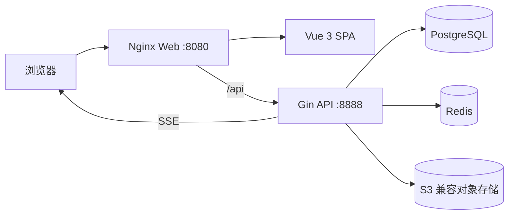

# YuYuan Pass System

YuYuan Pass System 是一套面向企业内部资产管理、文档协作和工作入口整合的管理平台。项目基于 Go、Gin、Vue 3、Element Plus 和 PostgreSQL 构建，提供资产全生命周期档案、可视化大屏、文档预览与在线编辑、站点收藏、公告提醒、媒体库和角色权限管理。

## 核心能力

| 模块 | 能力 |
| --- | --- |
| 资产大屏 | 资产数量、原值、当前估值、分类价值、状态构成、位置排行、最近登记 |
| 资产档案 | 资产编号、分类、品牌型号、序列号、数量、金额、状态、位置、保管人、照片和备注 |
| 资产分类 | 分类编码、名称、颜色、说明以及分类资产统计 |
| 资产流转 | 入库、领用、调拨、归还、维修、报废统一单据，支持草稿、提交和不可变流转记录 |
| 文档管理 | 文档上传、OSS 存储、源文件预览、Markdown/文本/Word/Excel 在线编辑和版本保存 |
| 站点管理 | 收藏 HTTP/HTTPS 工作站点，支持分类、搜索、启停和访问次数统计 |
| 公告中心 | 草稿、发布、SSE 实时提醒、未读数量、公告详情、附件和跨设备已读状态 |
| 媒体库 | 仅允许图片上传，统一写入 S3 兼容对象存储 |
| 系统设置 | 登录页图标配置、背景图库、OSS 上传、缩略图选择和启用管理 |
| 系统管理 | 用户、角色、菜单、API、字典、参数、操作记录、登录日志和 API Token |

## 界面体验

- 第二阶段已在“资产管理”下开放入库、领用、调拨、归还、维修和报废管理，六类业务共用统一单据模型。
- 桌面端登录页采用左右分区，背景图独立显示，登录表单固定在右侧，不遮挡背景内容。
- 移动端登录页自动切换为上方背景、下方表单的纵向布局。
- 登录图标与背景均可在“系统管理 → 系统配置”中维护，图片统一上传至对象存储。
- 展开的侧边栏左下方显示资产管理提示卡；折叠、移动端或低高度窗口会自动隐藏，避免遮挡菜单。
- 顶部公告铃铛显示未读数量，点击后可查看公告、标记单条已读或全部已读。

## 技术栈

### 服务端

- Go 1.24
- Gin 1.10
- GORM 1.31
- PostgreSQL 14-18
- Redis 6+
- JWT + Casbin RBAC
- MinIO / RustFS 等 S3 兼容对象存储

### Web 端

- Vue 3.5
- Vite 8
- Element Plus 2
- Pinia 2
- ECharts 5
- WangEditor、Mammoth、SheetJS、x-data-spreadsheet

### 部署

- 自维护多阶段 Dockerfile
- Docker Compose
- Nginx 静态资源与 API 反向代理

## 系统架构



## 目录结构

```text
.
├── server/                         Go 后端
│   ├── plugin/asset/               资产管理插件
│   ├── plugin/document/            文档管理插件
│   ├── plugin/site/                站点管理插件
│   ├── plugin/announcement/        公告与实时提醒
│   └── plugin/systemsetting/       登录图标与背景设置
├── web/                            Vue 3 前端
│   └── src/plugin/                 业务插件页面与 API
├── deploy/docker-dev/              Dockerfile、Compose 和运维脚本
├── docs/DEPLOYMENT.md              部署运维手册
├── docs/USER-GUIDE.md              用户使用文档
└── docs/PRODUCT-MANUAL.md          产品说明书
```

## 快速启动

以下步骤适用于已准备外部 PostgreSQL、Redis 和 S3 兼容对象存储的单机 Docker Compose 环境。生产部署、HTTPS、备份、更新和回滚请阅读[部署运维手册](docs/DEPLOYMENT.md)。

### 1. 环境要求

- Linux x86_64
- Docker 24+
- Docker Compose v2
- 可访问的 PostgreSQL、Redis 和 S3 兼容对象存储

数据库、缓存和对象存储默认使用外部服务，不由本项目的 Compose 创建。

### 2. 配置环境变量

```bash
cd deploy/docker-dev
cp .env.example .env
chmod 600 .env
```

编辑 `.env`，至少配置以下内容：

```dotenv
GVA_PG_HOST=127.0.0.1
GVA_PG_PORT=5432
GVA_PG_USER=postgres
GVA_PG_PASSWORD=change-me
GVA_PG_DB=gva

GVA_REDIS_ADDR=127.0.0.1:6379
GVA_REDIS_PASSWORD=change-me

GVA_RUSTFS_ENDPOINT=127.0.0.1:9000
GVA_RUSTFS_ACCESS_KEY=change-me
GVA_RUSTFS_SECRET_KEY=change-me
GVA_RUSTFS_BUCKET=gva-assets

GVA_ADMIN_PASSWORD=change-me-now
```

不要提交 `.env` 或运行时生成的 `config.yaml`。它们已加入项目级 `.gitignore`。

### 3. 构建并启动

```bash
chmod +x ./*.sh tools/*.sh
./up.sh
```

`up.sh` 会完成：

1. 从 `config.init.yaml` 生成运行时 `config.yaml`。
2. 写入 Redis 和 S3 兼容对象存储配置。
3. 构建前后端镜像。
4. 启动 Web 与 API 容器。
5. 首次运行时初始化 PostgreSQL 数据库和管理员账号。

### 4. 访问服务

| 服务 | 默认地址 |
| --- | --- |
| Web | `http://<服务器IP>:8080` |
| API | `http://<服务器IP>:8888` |
| Swagger | `http://<服务器IP>:8888/swagger/index.html` |

### 5. 常用运维命令

```bash
./ps.sh
./logs.sh server
./logs.sh web
./restart.sh
./down.sh
```

仅重建前端：

```bash
./build.sh web
docker compose --env-file .env -f docker-compose.yml up -d --force-recreate web
```

仅重建后端：

```bash
./build.sh server
docker compose --env-file .env -f docker-compose.yml up -d --force-recreate server
```

## 本地开发

### Web

```bash
cd web
npm install --legacy-peer-deps
npm run dev
```

### Server

```bash
cd server
go mod download
go run . -c config.yaml
```

本地开发前需准备独立的 `server/config.yaml`，不要将真实连接信息提交到仓库。

## 演示数据

部署完成后可以生成资产演示数据：

```bash
./deploy/docker-dev/tools/seed-assets.sh --count 100
```

脚本会生成家具、电脑、显示设备、网络设备、办公设备和生产设备等多类资产。演示数据使用固定前缀，可再次运行脚本清理并重建。

## 使用约定

- 媒体库只接受图片文件，图片统一上传到 OSS/S3 存储。
- 文档源文件和在线编辑版本分开保存，在线保存不会覆盖原始文件。
- Word、Excel 等文档默认先显示源文件预览，点击“开始编辑”后进入在线编辑模式。
- 公告只有处于“已发布”状态时才会通过 SSE 推送给在线用户。
- 资产状态、位置和保管人由资产业务单驱动；草稿不改变资产，提交后在事务中更新并生成审计记录。
- 当前每条资产档案作为完整流转单位，业务单会流转该档案记录的全部数量。
- 登录图标仅支持 JPG、PNG、WebP，单张不超过 2 MB；可随时恢复系统默认图标。
- 登录背景仅支持 JPG、PNG、WebP，上传后需要选择目标缩略图并保存才会生效。
- 非管理员角色需要在“系统管理 → 角色权限”中分配对应菜单和 API 权限。
- 菜单权限调整后需要刷新页面或重新登录，客户端才会重新获取最新动态菜单。

## 安全要求

- 生产环境必须修改管理员密码、JWT 签名密钥和所有外部服务凭据。
- PostgreSQL、Redis 和对象存储不应直接暴露到公网。
- 推荐通过 HTTPS 反向代理对外提供 Web 与 API 服务。
- 定期备份 PostgreSQL 数据库和对象存储桶。
- 发布前执行密钥扫描，确认 `.env`、`config.yaml`、私钥和服务器连接脚本未进入 Git。

## 文档

- [用户使用文档](docs/USER-GUIDE.md)
- [产品说明书](docs/PRODUCT-MANUAL.md)
- [部署运维手册](docs/DEPLOYMENT.md)
- [Docker 部署说明](deploy/docker-dev/README.md)
- [资产模块说明](ASSET-MVP.md)
- [前端设计规范](FRONTEND-STYLE.md)

## 项目状态

当前版本面向企业内部资产与知识协作场景，已具备可部署、可配置和可继续二次开发的完整前后端链路。登录品牌外观、响应式登录布局、侧边栏提示卡和公告未读提醒均已纳入正式功能。
