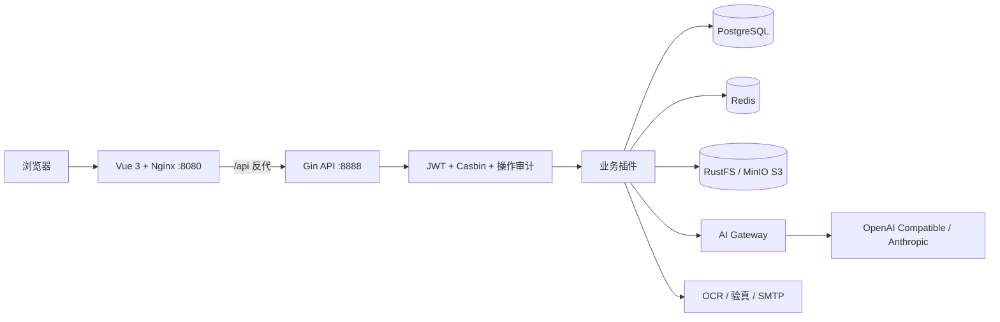

# mit-assets-admin

面向企业内部资产、票据、文档和协同办公的一体化管理平台。项目由 Go/Gin 服务端和 Vue 3 Web 端组成，提供资产全生命周期管理、发票识别复核、文档协作、日程公告、权限审计和可控的 AI 业务能力。

> 本 README 按仓库当前代码、配置模板和部署脚本整理。应用版本以 `web/package.json` 和服务端 Swagger 注释为准，当前为 `2.9.2`。

## 产品能力

| 领域 | 当前能力 |
| --- | --- |
| 工作台与驾驶舱 | 资产健康度、运营指标、最近登记、流转草稿、日程和公告摘要 |
| 资产管理 | 分类、位置、档案、照片、价值统计、入库、领用、调拨、归还、维修、报废 |
| 智能建档 | 多照片/铭牌识别、字段置信度、分类映射、序列号去重、人工确认后正式建档 |
| 资产风险 | 确定性风险规则、定时/手动扫描、证据、处理日志、失败续扫、高风险通知、批量清理 |
| 发票与流水 | 批量上传、OCR/多模态识别、人工复核、验真、分类、确认、防重和金额统计 |
| 识别质量 | Provider、模型、文件类型、字段修改、分类接受、失败、耗时和费用指标 |
| 文档与媒体 | 对象存储、图片/头像、Word、Excel、PDF、Markdown 和文本预览与编辑 |
| 协同办公 | 个人日程、重复规则、提醒收件箱、公告发布、已读状态、SSE 实时通知、站点收藏 |
| 系统外观 | 系统名称、登录图标、背景图库、主题模式和品牌配置 |
| 智能中心 | 业务助手、受控业务查询 Tool、会话、数据引用、知识片段检索和权限过滤 |
| 智能日报 | 当日/历史日报、资产/风险/发票/日程/公告指标、订阅、站内投递、邮件投递和导出 |
| 智能草稿 | 公告提取日程、资产运营业务单草稿、人工确认、过期和并发保护 |
| 平台治理 | JWT、Casbin、菜单/API/按钮权限、操作记录、登录日志、错误日志和数据清理 |

### 重要边界

- 资产、发票、公告、日程等实时业务数据由受控 Business Tool 查询，不直接复制进知识库。
- 知识库当前是按租户、部门、用户和角色归属的文本分片索引；知识来源需要由后端集成或业务流程写入，不能把它当作自动同步的全量业务库。
- 智能助手不是任意 SQL 或任意发信入口。模型只能选择已注册、可审计且经过权限检查的 Tool；报告邮件接口只接受服务端支持的报告类型。
- 当前编排实现位于 `server/plugin/smart/service`，采用规则规划器、受控 Tool Registry 和可选模型润色，不依赖 LangGraph 运行时。

## 系统架构


```mermaid
flowchart LR
    B[浏览器] --> W[Vue 3 + Nginx :8080]
    W -->|/api 反代| S[Gin API :8888]
    S --> A[JWT + Casbin + 操作审计]
    A --> P[业务插件]
    P --> DB[(PostgreSQL)]
    P --> R[(Redis)]
    P --> O[(RustFS / MinIO S3)]
    P --> G[AI Gateway]
    G --> M[OpenAI Compatible / Anthropic]
    P --> E[OCR / 验真 / SMTP]
```

Docker Compose 只负责 `web` 和 `server` 两个应用容器。数据库、缓存和对象存储必须提前准备，并通过 `.env` 注入连接信息。生产环境建议由 HTTPS 网关对外提供入口，只将 Web 容器暴露给反向代理。

## 代码结构

```text
mit-assets-admin/
├─ server/
│  ├─ ai/                         统一 AI Gateway、Provider、配额、脱敏和调用审计
│  ├─ middleware/                 JWT、Casbin、操作记录、AI 安全策略
│  ├─ initialize/                 配置、GORM、路由、插件和定时任务初始化
│  ├─ model/ api/ router/ service/系统公共层
│  └─ plugin/
│     ├─ asset/                   资产、流转、识别和风险中心
│     ├─ invoice/                 发票、流水和识别质量
│     ├─ smart/                   业务助手、知识检索、日报、邮件和草稿
│     ├─ aioperations/            AI 能力配置、识别服务、配额和运行监控
│     ├─ document/                文档与在线编辑
│     ├─ announcement/            公告与通知
│     ├─ schedule/                日程与提醒
│     ├─ site/                    站点收藏
│     ├─ systemsetting/           登录外观和品牌配置
│     ├─ email/                   SMTP 测试与通用邮件工具
│     └─ auto/ plugin-tool/       自动代码与插件辅助能力
├─ web/                           Vue 3 Web 端
├─ deploy/docker-dev/             Docker Compose、镜像、初始化和发布验收
├─ docs/                          产品、架构、API、数据、开发和运维文档
├─ design-system/                 视觉令牌与设计约定
├─ CONTEXT.md                     领域术语和数据边界
└─ FRONTEND-STYLE.md              前端主题与交互规范
```

## 技术栈

- 服务端：Go `1.25.x`、Gin `1.10.x`、GORM `1.31.x`、PostgreSQL 14-18、Redis 6+、JWT、Casbin、Zap、Cron、Swagger/Swaggo。
- Web：Vue `3.5.x`、Vite `8.x`、Element Plus `2.13.x`、Pinia、Vue Router、Axios、ECharts、Three.js、Vue Office、Mammoth、Marked、WangEditor、XLSX、Sass、UnoCSS。
- 外部能力：RustFS/MinIO/AWS S3、OCR、发票验真、OpenAI Compatible/Anthropic、SMTP。

## 快速开始

### 环境要求

Docker Engine 24+、Docker Compose v2、Go `1.25.x`、Node.js 当前 LTS、PostgreSQL 14-18、Redis 6+ 和 RustFS/MinIO 等 S3 兼容对象存储。

### Docker Compose（推荐）

```bash
cd deploy/docker-dev
cp .env.example .env
chmod 600 .env
# 编辑 .env，替换所有 change-me 和外部服务地址
chmod +x ./*.sh tools/*.sh
./up.sh
```

`up.sh` 会校验配置、生成运行时 `config.yaml`、构建镜像、启动容器、初始化数据库并执行发布验收。

| 服务 | 默认地址 |
| --- | --- |
| Web | `http://<服务器IP>:8080` |
| API | `http://<服务器IP>:8888` |
| Swagger | `http://<服务器IP>:8888/swagger/index.html` |

首次初始化创建 `admin` 用户，密码由 `.env` 中的 `GVA_ADMIN_PASSWORD` 决定。首次登录后应立即修改密码并创建日常账号。

### 必填配置示例

```dotenv
GVA_JWT_SIGNING_KEY=至少32字节的随机密钥
GVA_PG_HOST=127.0.0.1
GVA_PG_PORT=5432
GVA_PG_USER=postgres
GVA_PG_PASSWORD=change-me
GVA_PG_DB=gva
GVA_ADMIN_PASSWORD=change-me-now
GVA_USE_REDIS=true
GVA_REDIS_ADDR=127.0.0.1:6379
GVA_REDIS_PASSWORD=change-me
GVA_RUSTFS_ENDPOINT=127.0.0.1:9000
GVA_RUSTFS_ACCESS_KEY=change-me
GVA_RUSTFS_SECRET_KEY=change-me
GVA_RUSTFS_BUCKET=gva-assets
```

不要把真实密码、JWT 密钥、SMTP 授权码、AI API Key 或对象存储密钥写入 Git。`.env`、运行时 `config.yaml`、上传文件和日志均已加入忽略规则。

### 本地分离启动

```bash
cd server
go mod download
go run . -c config.yaml
```

```bash
cd web
npm install --legacy-peer-deps
npm run dev
```

本地后端需要自行准备 `server/config.yaml`；可参考 `deploy/docker-dev/config.init.yaml` 的结构，但不要直接复用示例密钥。

## 日常运维

所有脚本均在 `deploy/docker-dev/` 下执行：

| 命令 | 用途 |
| --- | --- |
| `./ps.sh` | 查看容器状态 |
| `./health-check.sh` | 快速检查 Web、API 和数据库状态 |
| `./logs.sh server` / `./logs.sh web` | 查看后端或 Nginx 日志 |
| `./restart.sh [web|server]` | 重启容器，不重建镜像 |
| `./build.sh [web|server]` | 构建全部或指定镜像 |
| `./release-acceptance.sh` | 发布后的只读验收门禁 |
| `./down.sh` | 停止应用容器和网络，不删除外部数据 |

代码更新后的标准流程：

```bash
git pull --ff-only
cd deploy/docker-dev
./build.sh
docker compose --env-file .env -f docker-compose.yml up -d --force-recreate
./release-acceptance.sh
```

只有验收脚本返回 `0` 才应标记版本上线成功。生产环境的临时发布包、备份和运行时临时文件应固定放在服务器项目目录下的 `workspace/`；该目录已被 Git 忽略，不要把临时文件写入 Windows 工作机或提交到 GitHub。

## 配置功能

### 品牌与主题

管理员可在系统设置中配置系统名称、登录图标、背景和主题模式。前端通过公开外观接口加载登录页资源，资源本体仍由后端执行鉴权和对象存储代理，避免浏览器直接访问私有 S3 地址。

### SMTP 与报告邮件

在“基础设置”中配置 SMTP 主机、端口、发件人、授权信息、SSL 和系统收件邮箱。配置完成后，智能日报页面可发送今日日报；投递状态、重试次数和失败原因会写入日报投递记录。

```http
POST /api/reportEmail/send
Content-Type: application/json
X-Token: <登录令牌>

{"reportType":"smart_daily","reportId":0}
```

收件人、主题和正文由服务端根据报告类型解析，客户端不能借此构造任意发信内容。当前支持 `smart_daily`，后续可增加资产、风险或发票报告提供器而不改变接口协议。

### 手机/邮箱验证码

手机和短信验证码默认关闭，只有在“基础设置 → 联系方式验证”完成服务商、Endpoint、访问令牌、签名和模板配置后才能开启。未完成配置时，开关保持关闭，避免产生不可用的验证流程。

## AI 与业务助手

AI 调用统一经过 `server/ai` Gateway：

1. 根据认证上下文确定用户和角色。
2. 检查模块权限、请求体大小、频率和超时。
3. 执行输入限制、脱敏和可选图片外发白名单检查。
4. 选择已配置的 Provider、Prompt 版本和 JSON Schema。
5. 执行配额/预算预占并记录成功、失败、耗时和估算费用。

业务助手的问答流程是“问题 → 规则规划器/受控 Tool → 实时业务查询 → 可选模型润色 → 引用和审计”。日程、未读公告、资产和发票等问题必须依赖对应 Tool 的权限与数据范围；模型不可直接读取数据库。当前编排位于 `server/plugin/smart/service`，不依赖 LangGraph 运行时。

## API 约定

- 浏览器统一通过 `/api` 调用；Web Nginx 转发时去掉 `/api` 前缀。
- 私有请求使用 `x-token` 和 `x-user-id`，当前用户 ID 以认证上下文为准，不能信任请求体。
- 统一响应结构为 `{code, data, msg}`，成功业务码为 `0`，鉴权失效通常返回 HTTP `401`。
- 分页参数统一使用 `page`、`pageSize`，列表返回 `list`、`total`、`page`、`pageSize`。
- 写接口应挂载操作审计；涉及 AI 的接口还应挂载频率、超时和调用审计策略。
- 文件下载/预览必须设置正确的 Content-Type、文件名和权限检查。

完整接口清单见 [docs/API.md](docs/API.md)，运行时 Swagger 是参数和响应的最终参考。

## 测试与质量门禁

```bash
# 服务端
cd server && go test ./...

# Web
cd ../web
npm test
npm run lint
npm run build

# 部署脚本
cd ../deploy/docker-dev
bash tests/release-acceptance-test.sh
./release-acceptance.sh

# 文本检查
git diff --check
```

页面变更至少检查桌面、移动端、亮/暗主题、加载、空数据、请求失败、无权限和长文本；列表默认分页大小为 `10`，超过 20 条的数据不得一次性渲染全部记录。

## 数据与安全原则

- 资产流转、发票确认和草稿确认使用事务；状态变化保存可追溯记录或前后快照。
- 发票金额以最小货币单位保存，已确认发票不能直接编辑，删除后的对象存储文件由可重试清理任务处理。
- 风险扫描按批次提交，使用业务指纹保证幂等，失败任务可续扫，风险处理写入独立日志。
- 原始图片、头像、发票和文档保存在 S3 兼容对象存储，数据库保存业务元数据；私有对象通过后端代理访问。
- PostgreSQL、Redis、S3 管理端口不应直接暴露公网；生产环境应使用 HTTPS、强 JWT 密钥和最小权限账号。
- 不提交 `.env`、`config.yaml`、证书、密钥、数据库备份、`server/uploads`、`server/log` 或 `workspace/`。
- 多租户/部门数据隔离以 Tenant 为最高边界，Department 树和角色 Data Scope 负责业务行范围；Casbin 负责 API/菜单权限，两者不能混用。

## 文档索引

| 文档 | 用途 |
| --- | --- |
| [docs/README.md](docs/README.md) | 文档中心和阅读路径 |
| [docs/PRODUCT-MANUAL.md](docs/PRODUCT-MANUAL.md) | 产品定位、用户和业务流程 |
| [docs/FUNCTIONAL-SPECIFICATION.md](docs/FUNCTIONAL-SPECIFICATION.md) | 功能规格、状态机和验收条件 |
| [docs/USER-GUIDE.md](docs/USER-GUIDE.md) | 用户操作手册 |
| [docs/API.md](docs/API.md) | API、鉴权和错误处理 |
| [docs/ARCHITECTURE.md](docs/ARCHITECTURE.md) | 分层、插件、数据流和权限架构 |
| [docs/DATA-DICTIONARY.md](docs/DATA-DICTIONARY.md) | 数据表、字段和枚举 |
| [docs/DEVELOPMENT.md](docs/DEVELOPMENT.md) | 本地开发、测试和提交规范 |
| [docs/DEPLOYMENT.md](docs/DEPLOYMENT.md) | 部署、升级、备份、回滚和故障处理 |
| [docs/SMART-ASSET-OPERATIONS-DEVELOPMENT-PLAN.md](docs/SMART-ASSET-OPERATIONS-DEVELOPMENT-PLAN.md) | 智能资产运营和 M5-M7 实施计划 |
| [CONTEXT.md](CONTEXT.md) | 领域术语、数据边界和命名约定 |
| [FRONTEND-STYLE.md](FRONTEND-STYLE.md) | 前端视觉、主题和响应式规范 |
| [design-system/](design-system/) | 设计系统资料 |

文档维护规则：路由或响应变更同步 `API.md`；表、字段或状态变更同步数据字典；用户可见功能同步产品说明和用户手册；环境变量、端口或脚本变更同步部署文档。文档中的“已验证”必须能由测试、验收脚本或实际 Git 提交追溯。

## 当前迭代建议

1. 持续用真实业务数据校准风险阈值、发票识别质量和 AI Tool 命中率。
2. 完成各业务插件的 Tenant/Department/Data Scope 统一迁移，并补齐跨角色负向权限测试。
3. 扩展报告提供器，保持 `reportEmail/send` 的受控类型协议和幂等投递记录。
4. 为正式收件邮箱配置 SMTP 后，验证站内、邮件成功/失败和重试链路。
5. 持续补齐 Swagger、CI 发布门禁和移动端视觉回归证据。

## 来源

项目当前模块名为 `github.com/WangMi2022/mit-assets-admin/server`。代码、文档和部署脚本以本仓库 `main` 分支为准；生产发布应使用已审核的 commit 或 tag，不要直接使用未固定的开发工作区。
