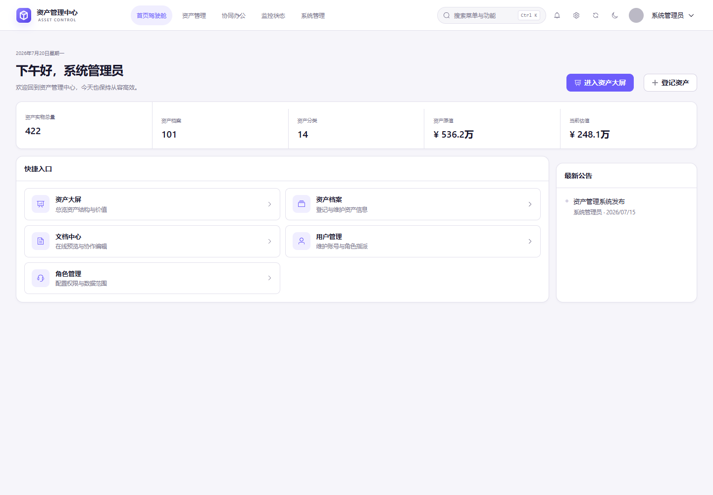
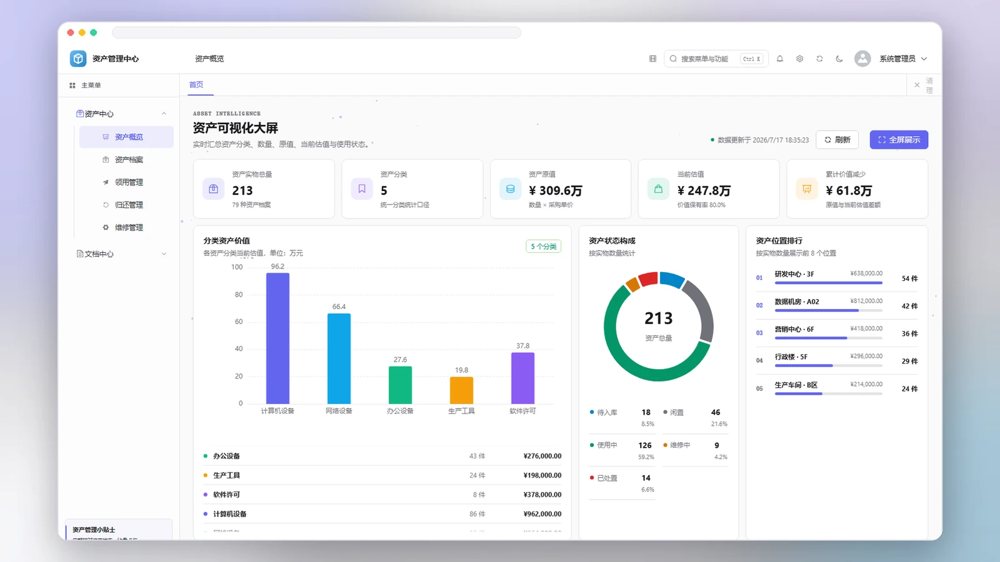
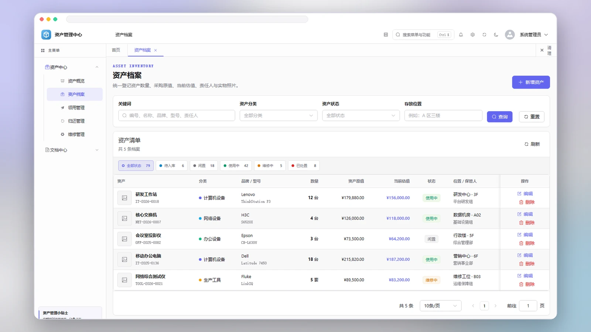
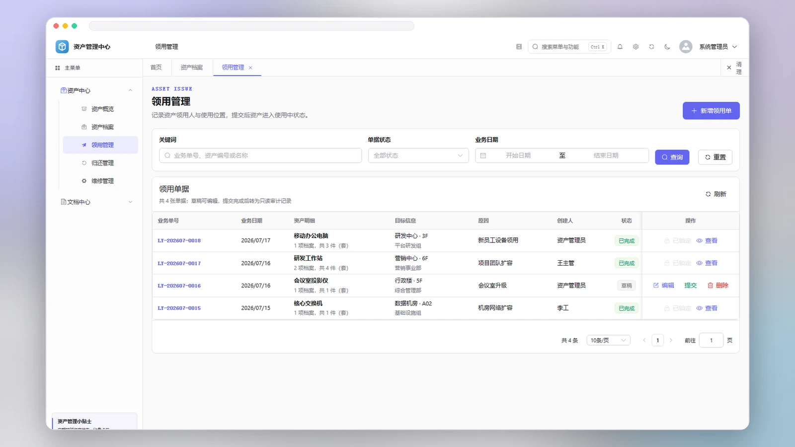
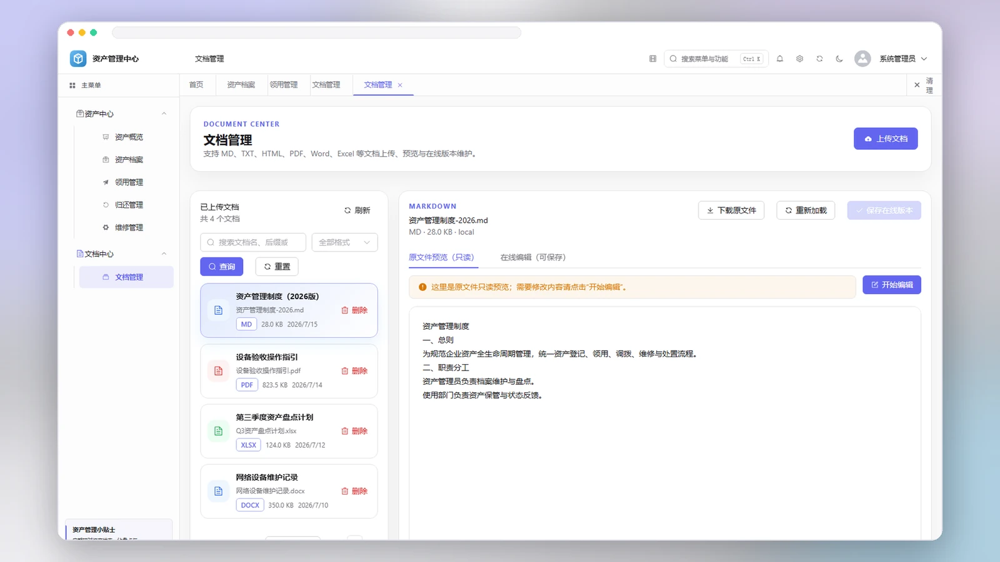
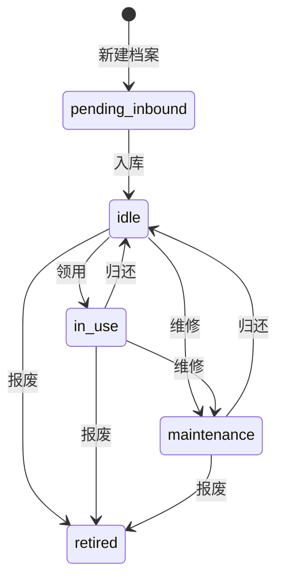
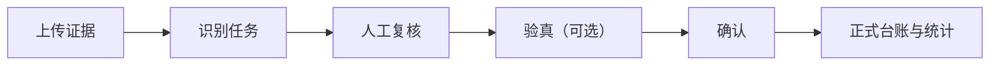
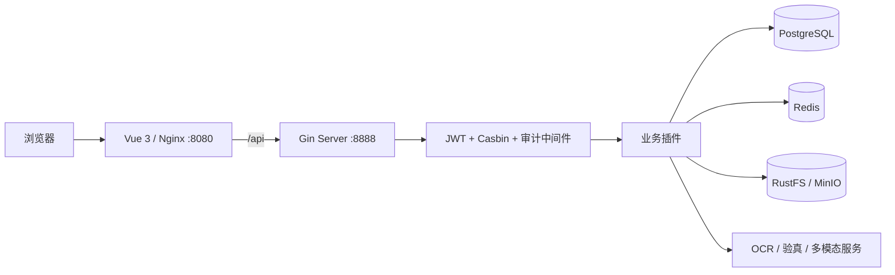

# YuYuan Pass System

<p align="center">
  <strong>面向企业内部资产、票据、文档与协同办公的一体化管理平台</strong>
</p>

<p align="center">
  Go · Gin · Vue 3 · PostgreSQL · Redis · RustFS/MinIO · JWT · Casbin
</p>

YuYuan Pass System 以资产全生命周期为核心，整合发票识别与流水、文档协作、个人日程、站点收藏、公告通知、系统外观、权限与审计。项目由 Gin-Vue-Admin 演进而来，已经形成独立的业务插件、数据模型、部署脚本和产品文档体系。

> 当前应用版本：`2.9.2`（来自 `web/package.json`）<br>
> 文档与项目整体审计：`2026-08-13`

## 界面预览

<p align="center">
  <a href="docs/images/admin-ui-lifecycle-orbit.png">
    
  </a>
</p>

<table>
  <tr>
    <td width="50%">
      <strong>资产可视化大屏</strong><br />
      <a href="web/src/assets/product/asset-dashboard.webp">
        
      </a>
    </td>
    <td width="50%">
      <strong>资产档案</strong><br />
      <a href="web/src/assets/product/asset-inventory.webp">
        
      </a>
    </td>
  </tr>
  <tr>
    <td width="50%">
      <strong>资产领用流程</strong><br />
      <a href="web/src/assets/product/asset-issue-workflow.webp">
        
      </a>
    </td>
    <td width="50%">
      <strong>文档管理中心</strong><br />
      <a href="web/src/assets/product/document-center.webp">
        
      </a>
    </td>
  </tr>
</table>

## 核心能力

| 业务域 | 已实现能力 |
| --- | --- |
| 首页驾驶舱 | 资产健康度、核心指标、最近登记、流转草稿与个人日程摘要 |
| 资产管理 | 分类、六类位置、资产档案、图片、价值统计、入库/领用/调拨/归还/维修/报废 |
| 资产审计 | 草稿与正式提交分离、事务更新、不可变前后快照、业务单查询 |
| 流水管理 | 发票批量上传、OCR/多模态识别、人工复核、验真、确认/重开、防重、分类规则和统计 |
| 文档管理 | 对象存储、源文件读取、Word/Excel/PDF/Markdown/文本预览与在线内容保存 |
| 工作日历 | 个人日程、每日/每周/每月重复规则、旧数据导入、持久化提醒与已读状态 |
| 协同办公 | 站点收藏、公告草稿/发布、SSE 实时通知、媒体库 |
| 系统外观 | 登录图标、背景图库、激活与恢复默认 |
| 权限审计 | JWT、Casbin、菜单/API/按钮权限、操作记录、登录日志和错误日志 |
| 运维交付 | Docker Compose、数据库初始化、健康检查、发布验收、备份与回滚手册 |

## 业务规则摘要

### 资产生命周期


```mermaid
stateDiagram-v2
    [*] --> pending_inbound: 新建档案
    pending_inbound --> idle: 入库
    idle --> in_use: 领用
    in_use --> idle: 归还
    idle --> maintenance: 维修
    in_use --> maintenance: 维修
    maintenance --> idle: 归还
    idle --> retired: 报废
    in_use --> retired: 报废
    maintenance --> retired: 报废
```

- 草稿不修改资产，提交后才在事务中更新状态、位置、保管人和审计快照。
- 调拨保持当前状态，只更新位置和可选保管人。
- 报废业务类型为 `scrap`，终态为 `retired`，处置位置字典类型为 `disposal`。
- 当前每条资产档案作为完整流转单位，不支持部分数量拆分。

### 发票处理


```mermaid
flowchart LR
    A["上传证据"] --> B["识别任务"]
    B --> C["人工复核"]
    C --> D["验真（可选）"]
    D --> E["确认"]
    E --> F["正式台账与统计"]
```

- 只有 `confirmed` 发票进入正式统计。
- 金额以整数分存储，避免浮点累计误差。
- 已确认发票不能直接修改，管理员需要先重开。
- 删除发票后由持久化清理任务重试删除对象存储证据。

## 系统架构


```mermaid
flowchart LR
    U["浏览器"] --> W["Vue 3 / Nginx :8080"]
    W -->|"/api"| S["Gin Server :8888"]
    S --> M["JWT + Casbin + 审计中间件"]
    M --> P["业务插件"]
    P --> DB[("PostgreSQL")]
    P --> R[("Redis")]
    P --> O[("RustFS / MinIO")]
    P --> X["OCR / 验真 / 多模态服务"]
```

当前 Compose 只运行 Web 和 Server 两个容器；PostgreSQL、Redis、RustFS/MinIO 使用外部服务。Web Nginx 将 `/api/*` 去掉 `/api` 前缀后转发到 Server。

## 技术栈

### 服务端

- Go `1.24.0` / toolchain `1.24.2`
- Gin `1.10.0`
- GORM `1.31.1`
- PostgreSQL 14-18
- Redis 6+
- JWT + Casbin
- Swaggo / Swagger
- Zap、Cron、S3 SDK

### Web

- Vue `3.5.x`
- Vite `8.x`
- Element Plus `2.13.x`
- Pinia、Vue Router、Axios
- ECharts、Three.js
- Vue Office、Mammoth、Marked、WangEditor、XLSX
- UnoCSS、Sass

### 部署

- Docker / Docker Compose
- Nginx
- 外部 PostgreSQL、Redis、RustFS/MinIO
- Bash 运维与发布验收脚本

## 目录结构

```text
.
├─ server/                       Go API、系统能力和业务插件
│  ├─ plugin/asset/              资产管理
│  ├─ plugin/invoice/            发票与流水
│  ├─ plugin/document/           文档管理
│  ├─ plugin/announcement/       公告通知
│  ├─ plugin/schedule/           个人日程
│  ├─ plugin/site/               站点收藏
│  └─ plugin/systemsetting/      登录外观
├─ web/                          Vue 3 Web 端
│  └─ src/plugin/                对应业务插件页面与 API
├─ deploy/docker-dev/            Compose、镜像、初始化与运维脚本
├─ docs/                         产品、使用、接口、架构、数据与部署文档
└─ design-system/                前端视觉系统说明
```

## 快速部署

### 环境要求

- Linux 服务器或支持 Docker Compose 的开发机。
- Docker Engine 24+、Docker Compose v2。
- 外部 PostgreSQL 14-18。
- 外部 Redis 6+。
- 外部 RustFS/MinIO S3 API。

### 1. 创建配置

```bash
cd deploy/docker-dev
cp .env.example .env
chmod 600 .env
```

编辑 `.env`，至少替换所有 `change-me`：

```dotenv
GVA_DB_TYPE=pgsql
GVA_PG_HOST=127.0.0.1
GVA_PG_PORT=5432
GVA_PG_USER=postgres
GVA_PG_PASSWORD=change-me
GVA_PG_DB=gva
GVA_ADMIN_PASSWORD=change-me-now

GVA_USE_REDIS=true
GVA_REDIS_ADDR=127.0.0.1:6379
GVA_REDIS_PASSWORD=change-me

GVA_RUSTFS_ENDPOINT=127.0.0.1:9000
GVA_RUSTFS_ACCESS_KEY=change-me
GVA_RUSTFS_SECRET_KEY=change-me
GVA_RUSTFS_BUCKET=gva-assets
```

### 2. 启动并验收

```bash
chmod +x ./*.sh tools/*.sh
./up.sh
./release-acceptance.sh
./ps.sh
```

默认访问：

| 服务 | 地址 |
| --- | --- |
| Web | `http://<服务器IP>:8080` |
| API | `http://<服务器IP>:8888` |
| Swagger | `http://<服务器IP>:8888/swagger/index.html` |

初始管理员用户名为 `admin`，密码由 `.env` 的 `GVA_ADMIN_PASSWORD` 决定。

> `.env` 和运行时 `config.yaml` 包含敏感信息，已被 Git 忽略，禁止提交。

## 本地开发

### Web

```bash
cd web
npm install --legacy-peer-deps
npm run dev
```

### Server

```bash
cd server
go mod download
go run . -c config.yaml
```

本地需要独立的 `server/config.yaml`。当前 Docker Compose 生产/集成方案使用 `deploy/docker-dev/config.init.yaml` 和 `.env` 生成 PostgreSQL 配置；`server/config.docker.yaml` 是保留的上游通用示例，不代表当前部署默认值。

## API 与权限

- 浏览器调用 Base URL：`/api`。
- Server 直连 Base URL：`http://<host>:8888`。
- 私有请求头：`x-token`、`x-user-id`。
- 统一 JSON 响应：`{code,data,msg}`，成功业务码为 `0`。
- JWT 失效通常返回 HTTP `401`。
- 系统管理接口以运行时 Swagger 为权威；业务插件接口见 [API 接口文档](docs/API.md)。

## 常用校验

```bash
# 服务端
cd server
go test ./...

# Web
cd web
npm test
npm run lint
npm run build

# 部署脚本回归
cd deploy/docker-dev
bash tests/release-acceptance-test.sh

# Git 文本检查
git diff --check
```

## 文档

| 文档 | 内容 |
| --- | --- |
| [文档中心](docs/README.md) | 全部文档的统一入口和阅读路径 |
| [项目审计报告](docs/PROJECT-AUDIT.md) | 技术栈、成熟度、风险和改进路线 |
| [智能资产运营中心开发实施文档](docs/SMART-ASSET-OPERATIONS-DEVELOPMENT-PLAN.md) | 智能建档、风险中心、业务助手和智能日报的执行路线 |
| [产品说明书](docs/PRODUCT-MANUAL.md) | 产品定位、用户、功能、流程和验收 |
| [功能规格说明](docs/FUNCTIONAL-SPECIFICATION.md) | 业务规则、状态机、权限与非功能要求 |
| [用户使用手册](docs/USER-GUIDE.md) | 资产、发票、日程、文档、公告和管理操作 |
| [API 接口文档](docs/API.md) | 鉴权、响应约定和业务接口清单 |
| [系统架构说明](docs/ARCHITECTURE.md) | 分层、插件、数据流、鉴权和部署架构 |
| [数据字典](docs/DATA-DICTIONARY.md) | 核心表、字段、枚举和关联关系 |
| [开发维护指南](docs/DEVELOPMENT.md) | 本地开发、测试、Swagger、Git 与发布 |
| [部署运维手册](docs/DEPLOYMENT.md) | 首次部署、升级、备份、回滚和故障处理 |

## 安全基线

- 修改管理员密码、JWT key、数据库、Redis 和对象存储凭据。
- 不将 PostgreSQL、Redis、S3 API 直接暴露到公网。
- 通过 HTTPS 反向代理对外服务。
- 定期备份 PostgreSQL 与对象存储桶。
- 发布前执行测试、构建、`git diff --check` 和敏感信息扫描。
- 只从已推送 Git commit 构建生产版本，保留完整 commit hash。

## 项目现状与路线

当前已经具备资产生命周期、发票处理、文档协作、个人日程、公告通知、权限审计和 Compose 交付闭环。下一阶段建议优先推进：

1. 启动阶段弱默认凭据检查和 CI 发布门禁。
2. 业务插件 Swagger 全覆盖。
3. 资产盘点、标签/二维码和审批流。
4. 发票识别队列监控、财务导出与外部系统集成。
5. 文档版本历史、全文检索和更细粒度数据权限。

详细结论见 [项目审计报告](docs/PROJECT-AUDIT.md)。
