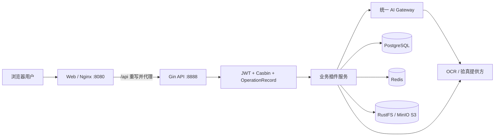
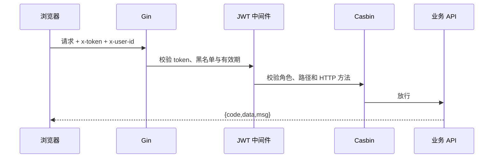
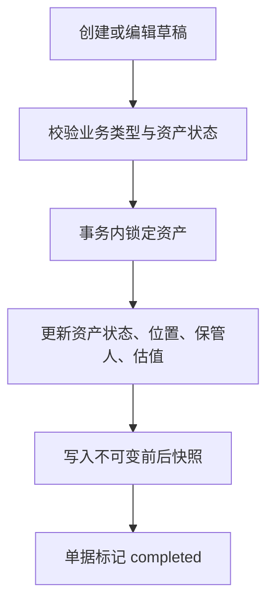
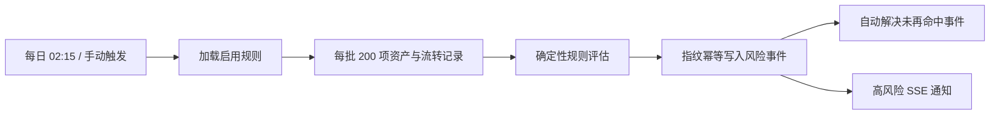
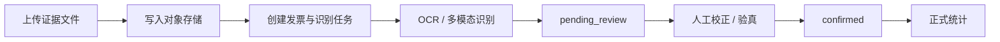
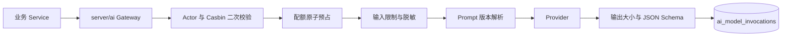

# YuYuan Pass System 系统架构说明

## 1. 架构目标

系统面向企业内部资产、票据、文档和协同办公场景，架构优先保证：

- 业务模块可独立演进。
- 权限、日志和审计能力统一复用。
- 文件证据与业务元数据分离存储。
- 部署过程可重复、可验证、可回滚。
- 前后端契约和状态机可被测试与追踪。

## 2. 总体拓扑



当前 Docker Compose 只负责 Web 和 Server。数据库、缓存和对象存储均是外部依赖。

## 3. 仓库结构

```text
gin-vue-admin/
├─ server/                     Go 服务端
│  ├─ api/v1/                 系统与示例 API 层
│  ├─ ai/                     统一 AI Gateway 深模块
│  ├─ initialize/             路由、GORM、插件初始化
│  ├─ middleware/             JWT、Casbin、操作记录等中间件
│  ├─ model/                  框架公共模型
│  ├─ plugin/                 业务插件
│  ├─ router/                 系统路由
│  ├─ service/                系统服务
│  └─ docs/                   Swagger 生成文件
├─ web/                        Vue 3 Web 端
│  └─ src/
│     ├─ api/                 系统公共 API 封装
│     ├─ components/          通用组件
│     ├─ pinia/               全局状态
│     ├─ plugin/              业务插件页面与 API
│     ├─ router/              动态路由
│     └─ view/                系统页面与工作日历等功能
├─ deploy/docker-dev/          Compose、镜像与运维脚本
├─ docs/                       产品、使用、架构、接口与运维文档
└─ design-system/              视觉系统说明
```

## 4. 服务端分层

### 4.1 路由层

`server/initialize/router.go` 创建 Gin Engine，并划分：

- `PublicGroup`：登录、验证码、健康检查、公开外观配置、公开公告和受控文件代理等。
- `PrivateGroup`：统一挂载 `JWTAuth()` 与 `CasbinHandler()`，用于受权限控制的系统和业务接口。
- 部分“只要求登录、不执行 Casbin API 匹配”的功能使用插件自行创建的 authenticated group，例如个人日程和公告通知。

所有路由均可通过 `system.router-prefix` 添加统一前缀。当前 Compose 默认前缀为空，Web Nginx 对外暴露 `/api` 并在转发时去除该前缀。

### 4.2 API 层

API 层负责：

- 绑定 JSON、query 或 multipart 参数。
- 调用校验和当前用户解析。
- 调用 Service。
- 使用统一 `response` 包封装结果。

API 层不应直接承担复杂事务、对象存储补偿或状态机逻辑。

### 4.3 Service 层

Service 层负责：

- 业务规则与状态校验。
- GORM 查询和事务。
- 对象存储读写。
- OCR、验真和分类提供方适配。
- AI Gateway、Provider、Prompt、Schema、配额、脱敏和调用审计。
- 资产流转、发票确认等领域动作。
- 资产风险规则评估、扫描恢复、事件状态机和处理审计。

### 4.4 Model 层

- `model`：持久化实体和核心常量。
- `model/request`：搜索、保存、批量操作等输入结构。
- `model/response`：面向列表或详情优化的输出结构。

## 5. 插件机制

业务插件通过 `interfaces.Register` 注册，并通常实现以下初始化能力：

1. GORM 自动迁移。
2. 路由注册。
3. 菜单初始化。
4. API 权限初始化。
5. 后台任务或 provider 初始化。

当前主要插件：

| 插件 | 职责 |
| --- | --- |
| `asset` | 资产档案、分类、位置、流转、大屏和风险中心 |
| `aioperations` | 智能能力配置、模型接入、识别服务、配额和运行监控 |
| `invoice` | 发票上传、识别、验真、审核、分类与统计 |
| `document` | 文档上传、预览、编辑和删除 |
| `announcement` | 公告发布、实时通知和已读状态 |
| `schedule` | 个人日程、重复规则和提醒收件箱 |
| `site` | 常用站点收藏与访问统计 |
| `systemsetting` | 登录图标和背景配置 |
| `email` | 邮件测试和发送 |

## 6. Web 架构

### 6.1 动态路由

系统菜单由后端返回，前端通过运行时 `router.addRoute` 装载页面。角色菜单权限决定页面可见性，Casbin API 权限决定请求是否可执行。

### 6.2 请求链路

`web/src/utils/request.js` 统一：

- 使用 `VITE_BASE_API` 设置 API Base URL。
- 注入 `x-token` 与 `x-user-id`。
- 处理新 token 响应头。
- 统一 Loading、业务错误和 `401` 退出处理。
- 对普通 JSON 响应解包，对文件流保留原始 Axios Response。

### 6.3 页面组织

- 业务插件页面位于 `web/src/plugin/<domain>/view`。
- 系统管理与框架页面位于 `web/src/view`。
- 工作日历当前位于 `web/src/view/workCalendar`，服务端能力由 `schedule` 插件提供。

## 7. 鉴权与授权



- 登录接口：`POST /base/login`。
- 验证码接口：`POST /base/captcha`。
- 成功业务码：`0`。
- 失败业务码：`7`。
- JWT 失效通常返回 HTTP `401`。

### 7.1 业务数据范围决策

系统已接受“Tenant 为最高业务边界、Department 树为租户内组织范围”的架构决策。Casbin 继续负责角色、路径和 HTTP 方法授权，不承担行级数据隔离；所有租户型 Service 将通过统一 Data Scope 限制本人、部门、部门子树、租户或平台管理员范围。

当前生产仍处于迁移前状态：发票和个人日程已有局部用户/角色过滤，资产、公告、文档和站点等模块尚未完成 Tenant/Department 字段与统一过滤。实施模型、迁移顺序和跨范围验收矩阵见 [租户与部门级数据隔离实施规格](TENANT-DEPARTMENT-DATA-ISOLATION.md)，硬边界决策见 [ADR-0001](adr/0001-tenant-department-data-isolation.md)。

## 8. 核心业务数据流

### 8.1 资产流转



草稿不修改资产；提交后不可按普通编辑流程回退。历史审计以 `asset_operation_records` 为准。

### 8.2 资产风险扫描



风险扫描由 `asset` 插件启动 Worker 注册，服务启动后会立即尝试执行或恢复任务。运行记录保存心跳、资产游标、续扫次数、扫描/新增/更新/关闭计数和错误；僵死或失败任务最多自动续扫 3 次。进程内原子锁与数据库新鲜心跳共同阻止重复扫描。

风险指纹包含资产、规则编码、规则版本和关键证据。规则升级后旧事件证据保留；已解决风险再次命中会自动重开，已忽略风险不会被扫描自动重开。首次命中和自动重开的高风险/严重风险通过通知 SSE 广播，持久事实仍以风险事件表为准。

### 8.3 发票处理



只有 `confirmed` 发票进入正式统计。已确认发票不能直接修改，管理员需先重开。

### 8.4 文件访问

- 原始文件保存于 S3 兼容对象存储。
- 数据库保存对象 key、元数据、在线编辑内容和业务状态。
- 资产照片、发票和文档证据均通过后端私有代理读取，并在返回对象前执行身份与数据授权校验。

### 8.5 AI Gateway



业务模块只依赖 `Gateway.Complete/Vision/Stream`，不持有 Provider Endpoint 和密钥。调用身份由认证 context 覆盖，失败和阻断路径同样写审计。图片仅允许配置白名单中的模块外发，Provider Endpoint 默认拒绝私有网络地址。

## 9. 数据一致性策略

- 单数据库业务更新使用 GORM 事务。
- 资产流转记录保存前后快照，避免依赖可变主表恢复历史。
- 资产风险每批在独立事务中提交，唯一指纹防重，不使用覆盖全表的长事务。
- 风险状态迁移与分配写入独立处理日志；完整扫描后自动解决本次未再命中的活动风险。
- 发票删除使用清理任务记录对象存储删除，降低数据库与文件存储跨资源不一致风险。
- 发票已确认防重使用持久化防重键和唯一约束。
- 日程提醒使用“用户 + 日程 + 发生时间”唯一索引保证重复任务幂等。

## 10. 配置体系

### 当前 Compose 部署配置

1. `.env` 保存外部服务地址和凭据，禁止提交。
2. `deploy/docker-dev/config.init.yaml` 提供 PostgreSQL 初始化模板。
3. `up.sh`/`configure-rustfs.sh` 生成或更新运行时 `config.yaml`。
4. Compose 将 `config.yaml` 挂载到 `/app/config.yaml`。
5. 智能服务密钥保存在运行时配置中；浏览器读取只能看到 `api-key-configured`，更新使用写入即隐藏字段。管理入口统一为 `系统管理 → 智能服务 → 智能能力配置`。

### 示例配置

`server/config.docker.yaml` 是保留的通用示例，包含多数据库和多 OSS 配置，默认值不代表当前生产方案。生产环境不得直接复用其中的 JWT key、Redis 地址或示例凭据。

## 11. 部署与发布边界

- `server/**` 变化：重建 Server。
- `web/**` 变化：重建 Web。
- 两端、部署文件或未知基线变化：同时重建。
- 纯文档变化不影响运行容器，但 GitHub 与部署源树仍应保持同一提交来源。
- 每次容器重建后执行 `release-acceptance.sh`，通过后记录部署 commit。

## 12. 可观测性

- Zap 应用日志。
- Gin Recovery 捕获 panic。
- 操作记录和登录日志入库。
- `/health` 提供存活检查。
- 服务器负载页面采集 CPU、内存、磁盘、系统负载与 Go runtime。
- `asset_risk_scan_runs` 记录扫描状态、心跳、游标、处理计数和失败详情，用于恢复与排障。
- 发布验收脚本检查容器、API、Web、代理链路和静态资源。

## 13. 架构演进原则

- 新业务优先成为深而独立的插件，而不是向系统包散落代码。
- 业务不变量由 Service 与数据库约束共同保护。
- 认证、授权、数据归属和文件访问在服务端强制执行。
- 跨数据库与对象存储的一致性使用可重试任务，不假设分布式事务。
- 接口、状态和数据口径变化必须同步更新技术文档与迁移说明。
