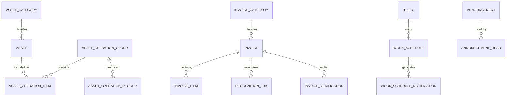

# YuYuan Pass System 数据字典

## 1. 通用字段

大多数 GORM 实体嵌入 `global.GVA_MODEL`，通常包含：

| 字段 | 类型 | 说明 |
| --- | --- | --- |
| `ID` | uint | 主键 |
| `CreatedAt` | timestamp | 创建时间 |
| `UpdatedAt` | timestamp | 更新时间 |
| `DeletedAt` | nullable timestamp | GORM 软删除时间，具体表是否使用以模型为准 |

业务金额与日期遵循：

- 资产金额使用数据库 numeric 和 Go `float64`，展示时统一保留两位小数。
- 发票金额使用 `int64` 分，避免浮点误差。
- 业务日期与时间戳分离：资产单据 `businessDate` 是业务日；创建时间是系统记录时间。

## 2. 核心实体关系

## 3. 资产域

### 3.1 `asset_categories`

| 字段 | 说明 |
| --- | --- |
| `name` | 分类名称 |
| `code` | 分类编码，业务唯一 |
| `color` | 统计与标签颜色 |
| `description` | 分类说明 |
| `sort` | 排序值 |
| `enabled` | 是否启用 |

### 3.2 `assets`

| 字段 | 说明 |
| --- | --- |
| `asset_code` | 资产编号，唯一业务标识；API 字段为 `assetCode` |
| `name` | 资产名称 |
| `category_id` | 分类外键 |
| `brand` / `model` | 品牌和规格型号 |
| `serial_number` | 序列号 |
| `quantity` / `unit` | 数量和计量单位 |
| `unit_price` | 采购单价 |
| `original_value` | 原值，数量 × 单价 |
| `current_value` | 当前估值 |
| `status` | 生命周期状态 |
| `location` | 当前存放位置文本 |
| `custodian` | 当前保管人文本 |
| `supplier` | 供应商 |
| `purchase_date` | 购置日期 |
| `warranty_end_date` | 质保到期日 |
| `photos` | JSONB 图片元数据数组 |
| `remarks` | 备注 |

资产状态：

| 值 | 说明 |
| --- | --- |
| `pending_inbound` | 待入库 |
| `idle` | 闲置 |
| `in_use` | 使用中 |
| `maintenance` | 维修中 |
| `retired` | 已处置/已报废 |

### 3.3 `asset_locations`

| 字段 | 说明 |
| --- | --- |
| `name` | 位置名称 |
| `type` | inbound/usage/transfer/return/maintenance/disposal |
| `code` | 位置编码 |
| `description` | 说明 |
| `sort` | 排序 |
| `enabled` | 是否可用于新单据 |

`type + name` 建立唯一索引，允许不同业务类型出现同名位置。注意报废业务单类型是 `scrap`，对应的位置字典类型是 `disposal`。

### 3.4 `asset_operation_orders`

| 字段 | 说明 |
| --- | --- |
| `order_no` | 业务单号，唯一 |
| `type` | `inbound/issue/transfer/return/maintenance/scrap` |
| `status` | `draft` 或 `completed` |
| `business_date` | 业务日期 |
| `target_location` | 目标位置文本快照 |
| `target_custodian` | 目标保管人文本快照 |
| `reason` / `remarks` | 原因和备注 |
| `created_by` / `submitted_by` | 创建人和提交人 |
| `submitted_at` | 提交时间 |

### 3.5 `asset_operation_items`

保存单据与资产的关联，以及提交时需要的资产显示快照。

### 3.6 `asset_operation_records`

保存每次正式流转的不可变审计记录，包括资产在流转前后的状态、位置、保管人和价值等快照。审计查询不应只依赖当前 `assets` 主表。

## 4. 发票域

### 4.1 `invoice_categories`

发票统计分类，字段包括名称、编码、说明、颜色、排序和启用状态。

### 4.2 `invoices`

| 字段 | 说明 |
| --- | --- |
| `direction` | 收入/支出方向，默认 `expense` |
| `invoice_type` | 业务票种 |
| `verification_type` | 验真标准票种 |
| `verification_amount_mode` | 验真金额使用不含税金额或价税合计 |
| `invoice_code` / `invoice_number` | 发票代码和号码 |
| `check_code` | 校验码 |
| `duplicate_key` | 已确认发票防重键，唯一 |
| `issue_date` | 开票日期 |
| `buyer_*` / `seller_*` | 购销双方名称和税号 |
| `amount_cents` | 不含税金额，单位分 |
| `tax_cents` | 税额，单位分 |
| `total_cents` | 价税合计，单位分 |
| `currency` | 币种，默认 CNY |
| `category_id` | 分类外键 |
| `classification_source` | `auto` 或 `manual` |
| `status` | 发票处理状态 |
| `verification_status` | 验真状态 |
| `file_key` 等 | 原始证据对象信息 |
| `confirmed_by/at` | 确认人和确认时间 |

处理状态：

| 值 | 说明 |
| --- | --- |
| `uploaded` | 文件已上传 |
| `recognizing` | 识别中 |
| `pending_review` | 待人工复核 |
| `confirmed` | 已确认 |
| `recognition_failed` | 识别失败 |

验真状态：`unverified`、`verifying`、`verified_valid`、`verified_voided`、`verified_red`、`inconsistent`、`not_found`、`deferred`、`expired`、`unavailable`。

### 4.3 `invoice_items`

发票明细行，包含名称、规格、数量、单价、金额、税率和税额等字段。财务统计禁止用二进制浮点直接累计。

### 4.4 `invoice_recognition_jobs`

持久化识别任务：provider、状态、尝试次数、开始/结束时间和失败详情。状态包括 `pending`、`processing`、`completed`、`failed`。

### 4.5 `invoice_verifications`

每次验真尝试的历史记录，包括结果、差异和时间。对外响应应过滤提供方敏感原始数据。

### 4.6 `invoice_classification_rules`

分类匹配规则，维护匹配字段、关键词、目标分类、分值、优先级和启用状态。

### 4.7 `invoice_file_cleanup_jobs`

发票删除后的对象清理任务。通过租约和重试实现幂等，避免数据库已删除但对象文件永久残留。

## 5. 文档域

### `document_files`

| 字段 | 说明 |
| --- | --- |
| `title` | 文档标题 |
| `original_name` | 上传文件名 |
| `file_ext` | 扩展名 |
| `file_size` | 文件大小，字节 |
| `mime_type` | MIME |
| `storage_type` | 存储类型 |
| `file_key` | 对象 key |
| `file_url` | 访问地址或代理信息 |
| `content` | 在线编辑内容 |
| `editable` | 是否支持在线编辑 |
| `remarks` | 备注 |

列表响应刻意不返回 `content` 和存储地址，避免批量读取大字段与泄露内部对象信息。

## 6. 公告域

### 6.1 `gva_announcements_info`

- `title`、`content`、`user_id`。
- `attachments`：JSON 附件数组。
- `status`：草稿或已发布。
- `published_at`：发布时间。

### 6.2 `gva_announcement_reads`

以 `user_id + announcement_id` 唯一，保存 `read_at`，用于跨设备未读同步。

## 7. 日程域

### 7.1 `work_schedules`

| 字段 | 说明 |
| --- | --- |
| `user_id` | 所属用户，只由认证上下文确定 |
| `client_key` | 旧客户端数据迁移幂等键 |
| `title` | 标题 |
| `schedule_date` / `schedule_time` | 首次发生日期和时间 |
| `type` | 日程类型 |
| `note` | 备注 |
| `recurrence_enabled` | 是否重复 |
| `recurrence_mode` | daily/weekly/monthly |
| `recurrence_weekday(s)` | 每周规则 |
| `recurrence_month_day(s)` | 每月规则 |

### 7.2 `work_schedule_notifications`

持久化到期提醒，以 `user_id + schedule_id + occurrence_at` 唯一，保证 Cron 重试和进程重启不重复生成。

## 8. 站点与外观

| 表 | 说明 |
| --- | --- |
| `site_bookmarks` | 站点名称、URL、分类、说明、颜色、排序、启用、访问次数和最近访问时间 |
| `system_login_logos` | 当前自定义登录图标 |
| `system_login_backgrounds` | 登录背景图库、创建人和启用状态 |

## 9. AI Gateway

### 9.1 `ai_model_invocations`

模型调用审计摘要。该表禁止保存完整 Prompt、业务 Payload、图片、模型输出和 Provider 密钥。

| 字段 | 说明 |
| --- | --- |
| `request_id` | UUID 调用追踪 ID，唯一 |
| `user_id` / `authority_id` | 认证用户和角色 |
| `module` / `operation` | 业务模块和动作 |
| `provider` / `model` | 实际 Provider 和模型 |
| `prompt_key` / `prompt_version` | 使用的 Prompt 版本 |
| `input_tokens` / `output_tokens` | Provider 返回或本地估算的 Token |
| `estimated_cost_micros` | 按配置单价估算的费用微单位 |
| `duration_ms` | 调用耗时毫秒 |
| `status` | `success/failed/blocked` |
| `error_type` | `disabled/validation/policy/quota/provider/timeout/schema` |
| `object_type` / `object_id` | 可选业务对象关联 |
| `redaction_count` | 本次脱敏命中数 |
| `input_hash` / `output_hash` | 输入和输出 SHA-256 哈希 |

### 9.2 `ai_usage_quotas`

| 字段 | 说明 |
| --- | --- |
| `scope_type` | `global/module/authority/user` |
| `scope_id` | `global`、模块标识、角色 ID 或用户 ID |
| `daily_requests` | 每日请求上限，0 不限制 |
| `daily_tokens` | 每日 Token 上限，0 不限制 |
| `monthly_cost_micros` | 每月费用上限，0 不限制 |
| `max_concurrency` | 最大并发，0 不限制 |
| `enabled` | 是否参与配额匹配 |

`scope_type + scope_id` 唯一。单实例内通过原子预占避免并发突发绕过；多 Server 实例部署需改用共享原子计数。

### 9.3 `ai_prompt_templates`

| 字段 | 说明 |
| --- | --- |
| `prompt_key` | 稳定业务标识 |
| `version` | 从 1 递增的版本号 |
| `content` | Prompt 模板正文 |
| `output_schema` | 可选 JSON Schema |
| `status` | `draft/active/retired` |
| `created_by` | 创建用户 |
| `activated_at` | 激活时间 |

`prompt_key + version` 唯一。同一 `prompt_key` 仅保留一个 `active` 版本；新建版本发生并发冲突时服务层重新分配版本号。

## 10. 系统表

系统用户、角色、菜单、API、Casbin、字典、参数、操作记录、登录日志、JWT 黑名单等表继承 Gin-Vue-Admin 模型。维护时优先通过系统模块 API 和迁移逻辑修改，不直接手工破坏权限关联表。

## 11. 迁移与备份原则

1. 生产升级前备份 PostgreSQL 与对象存储。
2. 自动迁移只解决兼容性建表/加字段，不等同于数据修复方案。
3. 重命名、拆表、金额口径变化必须提供显式迁移脚本和回滚说明。
4. 删除包含对象 key 的业务数据前，先设计对象存储清理或补偿任务。
5. 历史审计表和已确认财务数据不得以普通清理脚本覆盖。
