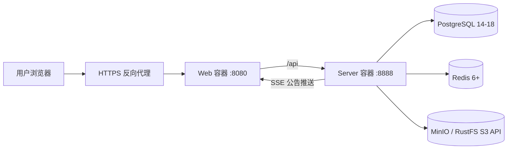

# YuYuan Pass System 部署运维手册

## 1. 适用范围

本文说明 YuYuan Pass System 在 Linux 单机上的 Docker Compose 部署方式，覆盖环境准备、首次初始化、升级、健康检查、HTTPS、备份恢复、回滚和常见故障处理。

当前 Compose 只管理以下应用容器：

- `web`：Nginx + Vue 静态文件，默认映射端口 `8080`。
- `server`：Gin API、SSE、Swagger 和业务服务，默认映射端口 `8888`。

PostgreSQL、Redis、MinIO/RustFS 不在 Compose 中创建，需要提前准备。

## 2. 部署拓扑



测试环境可以直接开放 `8080` 和 `8888`。生产环境建议只对外开放 `80/443`，由外层 Nginx、HAProxy 或网关转发到 `8080`。

## 3. 服务器要求

### 3.1 推荐配置

| 项目 | 最低配置 | 推荐配置 |
| --- | --- | --- |
| CPU | 2 核 | 4 核以上 |
| 内存 | 4 GB | 8 GB以上 |
| 系统盘 | 20 GB | 50 GB以上 |
| 系统 | Linux x86_64 | Ubuntu 22.04+/Rocky Linux 9+ |
| Docker | 24+ | 当前稳定版 |
| Compose | v2 | 当前稳定版 |

镜像首次构建会下载 Go、Node 和 Nginx 基础镜像，需要访问镜像仓库和依赖源。

### 3.2 运维工具

宿主机需要：

- `git`
- `curl`
- `bash`
- `python3`
- Docker Engine
- Docker Compose Plugin

验证：

```bash
docker version
docker compose version
git --version
curl --version
python3 --version
```

## 4. 网络与端口

应用服务器需要访问：

| 目标 | 默认端口 | 用途 |
| --- | --- | --- |
| PostgreSQL | 5432 | 业务数据库 |
| Redis | 6379 | 缓存、验证码和会话相关能力 |
| MinIO/RustFS S3 API | 9000 | 图片与文档上传下载 |
| MinIO/RustFS Console | 9001 | 对象存储管理，可不对应用服务器开放 |

应用服务器默认监听：

| 端口 | 用途 | 生产环境建议 |
| --- | --- | --- |
| 8080 | Web | 仅允许反向代理或内网访问 |
| 8888 | API/Swagger | 仅允许本机或内网访问 |
| 80/443 | 外部入口 | 对业务用户开放 |

连通性检查：

```bash
nc -vz <PG_HOST> 5432
nc -vz <REDIS_HOST> 6379
curl -I http://<S3_HOST>:9000/
```

## 5. 外部服务准备

### 5.1 PostgreSQL

支持 PostgreSQL 14-18，推荐使用 UTF-8 编码和 `Asia/Shanghai` 时区。

自动初始化会连接 `postgres` 数据库并执行 `CREATE DATABASE`，因此首次初始化账号需要具备 `CREATEDB` 权限。数据库初始化完成后，可根据组织安全策略收回该权限，但账号仍需拥有目标数据库和表的读写、建表及迁移权限。

验证数据库：

```bash
psql -h <PG_HOST> -p 5432 -U <PG_USER> -d postgres -c 'select version();'
```

如果数据库由 DBA 预先创建，应确认：

- 数据库名与 `.env` 的 `GVA_PG_DB` 一致。
- 应用账号是数据库 owner，或具有 schema 创建与对象管理权限。
- `pg_hba.conf` 允许应用服务器连接。
- 防火墙只允许可信网段访问 5432。

### 5.2 Redis

建议启用密码和持久化，并限制为内网访问。

```bash
redis-cli -h <REDIS_HOST> -p 6379 -a '<REDIS_PASSWORD>' PING
```

期望返回 `PONG`。如不使用 Redis，需要同时将 `.env` 中 `GVA_USE_REDIS=false`，但验证码、缓存和部分会话能力可能降级。

### 5.3 MinIO / RustFS

应用连接 S3 API 端口，不能使用管理控制台端口。默认配置：

- 桶：`gva-assets`
- 对象前缀：`assets/`
- S3 API：`9000`
- 管理控制台：`9001`

应用凭据至少需要目标桶的对象读取、写入和删除权限。当前页面使用可访问的对象 URL 展示头像、资产图片和登录背景，因此桶需要提供可读 URL；如果不能公开桶，应通过内网网关或对象存储代理提供受控读取地址。

使用 MinIO Client 验证：

```bash
mc alias set asset-store http://<S3_HOST>:9000 <ACCESS_KEY> <SECRET_KEY>
mc mb --ignore-existing asset-store/gva-assets
mc ls asset-store/gva-assets
```

## 6. 获取代码

```bash
git clone git@github.com:WangMi2022/YuYuan-Pass-System.git
cd YuYuan-Pass-System/deploy/docker-dev
```

生产环境建议部署已确认的 tag 或 commit，不要长期直接跟随不固定的开发分支。

## 7. 环境变量

创建配置：

```bash
cp .env.example .env
chmod 600 .env
```

编辑 `.env`，将所有 `change-me` 替换为真实值。

密码中包含 `#`、空格或其他 Shell 特殊字符时应使用引号包裹，并在执行 `./up.sh` 前通过 `bash -n .env` 或单独测试加载确认格式正确。生产环境优先使用密码管理器生成不易产生 Shell/Compose 解析歧义的高强度凭据。

### 7.1 应用与端口

| 变量 | 示例 | 说明 |
| --- | --- | --- |
| `PROJECT_NAME` | `yuyuan-pass` | Compose 项目名 |
| `SERVER_IMAGE` | `yuyuan-pass-server:1.0.0` | 后端镜像名和版本 |
| `WEB_IMAGE` | `yuyuan-pass-web:1.0.0` | 前端镜像名和版本 |
| `SERVER_CONTAINER` | `yuyuan-pass-server` | 后端容器名 |
| `WEB_CONTAINER` | `yuyuan-pass-web` | 前端容器名 |
| `SERVER_PORT` | `8888` | API 宿主机端口 |
| `WEB_PORT` | `8080` | Web 宿主机端口 |

### 7.2 PostgreSQL

| 变量 | 说明 |
| --- | --- |
| `GVA_DB_TYPE` | 固定为 `pgsql` |
| `GVA_PG_HOST` | PostgreSQL 地址，不带协议 |
| `GVA_PG_PORT` | PostgreSQL 端口 |
| `GVA_PG_USER` | 首次具备建库权限的账号 |
| `GVA_PG_PASSWORD` | 数据库密码 |
| `GVA_PG_DB` | 业务数据库名 |
| `GVA_PG_TEMPLATE` | 推荐 `template0` |
| `GVA_ADMIN_PASSWORD` | 首次创建的 `admin` 账号密码 |

`GVA_ADMIN_PASSWORD` 只在首次初始化数据库时生效。后续修改 `.env` 不会重置管理员密码，需要在系统用户管理中修改。

### 7.3 Redis

| 变量 | 说明 |
| --- | --- |
| `GVA_USE_REDIS` | 是否启用 Redis |
| `GVA_REDIS_ADDR` | 地址和端口，如 `redis.internal:6379` |
| `GVA_REDIS_PASSWORD` | Redis 密码 |
| `GVA_REDIS_DB` | Redis DB 编号 |

### 7.4 对象存储

| 变量 | 说明 |
| --- | --- |
| `GVA_RUSTFS_ENDPOINT` | S3 API 地址，不带 `http://` |
| `GVA_RUSTFS_CONSOLE` | 管理控制台地址，仅作运维记录 |
| `GVA_RUSTFS_ACCESS_KEY` | Access Key |
| `GVA_RUSTFS_SECRET_KEY` | Secret Key |
| `GVA_RUSTFS_BUCKET` | 桶名 |
| `GVA_RUSTFS_BASE_PATH` | 对象前缀 |
| `GVA_RUSTFS_USE_SSL` | S3 API 是否使用 HTTPS |

## 8. 首次部署

### 8.1 设置脚本权限

```bash
chmod +x ./*.sh tools/*.sh
```

### 8.2 一键启动

```bash
./up.sh
```

脚本执行顺序：

1. 检查 `.env` 和必填变量。
2. 从 `config.init.yaml` 复制生成 `config.yaml`。
3. 将 Redis 和 S3 配置写入运行配置。
4. 构建 Server 和 Web 镜像。
5. 启动两个容器。
6. 等待后端就绪。
7. 创建 PostgreSQL 数据库、表、基础菜单和管理员。
8. 执行健康检查并显示容器状态。

首次构建耗时取决于网络和服务器性能。不要在构建尚未结束时重复执行 `up.sh`。

### 8.3 查看初始化日志

```bash
./logs.sh server
```

出现数据库初始化完成、路由注册成功和服务监听信息后，后端已正常启动。

### 8.4 登录

- 地址：`http://<服务器IP>:8080`
- 用户名：`admin`
- 密码：首次部署时设置的 `GVA_ADMIN_PASSWORD`

首次登录后立即修改管理员密码，并按最小权限原则创建日常使用账号。

## 9. 部署验证

执行自动检查：

```bash
./health-check.sh
```

手动检查：

```bash
# 容器状态
./ps.sh

# Web 首页
curl -I http://127.0.0.1:${WEB_PORT:-8080}/

# API 与数据库初始化状态
curl -X POST http://127.0.0.1:${SERVER_PORT:-8888}/init/checkdb

# Swagger
curl -I http://127.0.0.1:${SERVER_PORT:-8888}/swagger/index.html

# 登录外观公开配置
curl http://127.0.0.1:${SERVER_PORT:-8888}/appearance/login-logo
curl http://127.0.0.1:${SERVER_PORT:-8888}/appearance/login-background
```

验收结果应满足：

- Web 返回 HTTP 200。
- `checkdb` 返回 `needInit: false`。
- 两个容器保持 `Up`，没有反复重启。
- 登录、资产大屏、图片上传和公告提醒可用。
- 浏览器控制台没有动态模块 MIME 或旧资源加载错误。

## 10. 日常运维

### 10.1 查看状态

```bash
./ps.sh
./health-check.sh
docker stats
```

### 10.2 查看日志

```bash
./logs.sh server
./logs.sh web
```

查看指定时间范围：

```bash
docker logs --since=30m yuyuan-pass-server
docker logs --since=30m yuyuan-pass-web
```

容器名以 `.env` 中配置为准。

### 10.3 重启

```bash
# 重启全部，不重建镜像
./restart.sh

# 仅重启后端
./restart.sh server
```

`restart.sh` 不会读取新代码或重新构建镜像。更新代码必须执行构建和强制重建。

### 10.4 停止

```bash
./down.sh
```

该命令只删除应用容器和 Compose 网络，不删除外部 PostgreSQL、Redis 和对象存储数据。

## 11. 版本更新

### 11.1 更新前

1. 确认当前 commit 或 tag。
2. 备份 PostgreSQL、对象存储和运行配置。
3. 阅读本次版本的数据库与配置变更。
4. 在维护窗口执行更新。

```bash
git status
git rev-parse HEAD
cp deploy/docker-dev/config.yaml deploy/docker-dev/config.yaml.before-upgrade
```

### 11.2 更新全部服务

```bash
git pull --ff-only
cd deploy/docker-dev
./build.sh
docker compose --env-file .env -f docker-compose.yml up -d --force-recreate
./health-check.sh
```

### 11.3 仅更新 Web

```bash
./build.sh web
docker compose --env-file .env -f docker-compose.yml up -d --force-recreate web
./health-check.sh
```

### 11.4 仅更新 Server

```bash
./build.sh server
docker compose --env-file .env -f docker-compose.yml up -d --force-recreate server
./health-check.sh
```

后端启动时会执行 GORM 自动迁移。包含模型变更的版本更新前必须先备份数据库。

### 11.5 登录外观功能更新

登录图标配置同时包含前端页面、后端接口和 `system_login_logos` 数据表，升级到包含该功能的版本时必须同时重建 Server 与 Web，不能只更新前端：

```bash
git pull --ff-only
cd deploy/docker-dev
./build.sh server web
docker compose --env-file .env -f docker-compose.yml up -d --force-recreate server web
./health-check.sh
```

Server 启动时会自动创建或更新外观配置相关数据表。部署完成后应验证：

1. `/appearance/login-logo` 和 `/appearance/login-background` 返回 `code: 0`。
2. 管理员可以在“系统管理 → 系统设置”上传和恢复登录图标。
3. 上传登录背景并保存后，刷新登录页可以看到新背景。
4. 对象存储中的图片 URL 可以从用户浏览器直接访问。

### 11.6 资产流转功能更新

第二阶段资产流转同时包含前后端、菜单权限和数据模型变更，升级时必须重建 Server 与 Web。后端启动后会自动迁移以下数据表：

- `asset_operation_orders`
- `asset_operation_items`
- `asset_operation_records`

```bash
git pull --ff-only
cd deploy/docker-dev
./build.sh server web
docker compose --env-file .env -f docker-compose.yml up -d --force-recreate server web
./health-check.sh
```

升级完成后重新登录以刷新动态菜单，并验证默认管理员可以看到六个流转菜单。生产验收至少执行一次“保存草稿 → 编辑 → 提交”，确认资产状态发生预期变化且 Server 日志没有事务错误。

### 11.7 状态、演示数据与服务器监控更新

本次更新增加“待入库”状态、服务器负载字段、监控菜单，并恢复系统管理完整菜单。升级后执行演示数据脚本可幂等重建 `DEMO-ASSET-*` 数据及对应生命周期单据：

```bash
./deploy/docker-dev/tools/seed-assets.sh --count 100 --prefix DEMO-ASSET --reset=true
```

脚本只清理指定前缀的演示档案、相关明细和审计记录，不处理正式资产。执行后应验证：

1. 14 个分类均有资产，演示档案共 100 条。
2. 状态分布为待入库 10、闲置 20、使用中 50、维修中 10、已处置 10。
3. 六类生命周期单据均有数据，报废资产当前估值为 0。
4. “监控状态 → 服务器负载”能够返回主机、负载、CPU、内存和磁盘信息。
5. 系统管理完整菜单可见，左侧多个父菜单可以同时保持展开。

## 12. 备份与恢复

### 12.1 备份运行配置

```bash
install -d -m 700 /data/backup/yuyuan-pass/config
cp -a deploy/docker-dev/.env deploy/docker-dev/config.yaml /data/backup/yuyuan-pass/config/
chmod 600 /data/backup/yuyuan-pass/config/*
```

备份目录不能进入 Web 根目录或公共文件服务。

### 12.2 备份 PostgreSQL

```bash
export PGPASSWORD='<数据库密码>'
pg_dump \
  -h <PG_HOST> -p 5432 -U <PG_USER> \
  -Fc -d <PG_DATABASE> \
  -f /data/backup/yuyuan-pass/yuyuan-pass-$(date +%Y%m%d%H%M%S).dump
unset PGPASSWORD
```

恢复到空数据库：

```bash
export PGPASSWORD='<数据库密码>'
pg_restore \
  -h <PG_HOST> -p 5432 -U <PG_USER> \
  --clean --if-exists -d <PG_DATABASE> \
  /data/backup/yuyuan-pass/<备份文件>.dump
unset PGPASSWORD
```

恢复前应停止写入，并先在测试数据库验证备份文件。

### 12.3 备份对象存储

```bash
mc mirror asset-store/gva-assets /data/backup/yuyuan-pass/gva-assets
```

恢复：

```bash
mc mirror /data/backup/yuyuan-pass/gva-assets asset-store/gva-assets
```

数据库和对象存储应使用同一备份时间点，避免文档记录与对象文件不一致。

## 13. 版本回滚

```bash
# 记录当前版本
git rev-parse HEAD

# 切换到上一个已验证 tag 或 commit
git checkout <tag-or-commit>

cd deploy/docker-dev
./build.sh
docker compose --env-file .env -f docker-compose.yml up -d --force-recreate
./health-check.sh
```

如果新版本已经执行不兼容的数据迁移，只回滚代码可能无法恢复，应同时按升级前备份恢复数据库。不要使用 `git reset --hard` 处理包含本地配置或未提交改动的部署目录。

## 14. HTTPS 反向代理

生产环境推荐在宿主机或统一网关终止 TLS，只将 Web 容器暴露给代理。

外层 Nginx 示例：

```nginx
server {
    listen 443 ssl;
    http2 on;
    server_name assets.example.com;

    ssl_certificate     /etc/nginx/certs/fullchain.pem;
    ssl_certificate_key /etc/nginx/certs/privkey.pem;

    client_max_body_size 100m;

    location = /api/info/stream {
        proxy_pass http://127.0.0.1:8080;
        proxy_http_version 1.1;
        proxy_set_header Host $host;
        proxy_set_header X-Real-IP $remote_addr;
        proxy_set_header X-Forwarded-For $proxy_add_x_forwarded_for;
        proxy_set_header X-Forwarded-Proto $scheme;
        proxy_buffering off;
        proxy_cache off;
        proxy_read_timeout 3600s;
    }

    location / {
        proxy_pass http://127.0.0.1:8080;
        proxy_http_version 1.1;
        proxy_set_header Host $host;
        proxy_set_header X-Real-IP $remote_addr;
        proxy_set_header X-Forwarded-For $proxy_add_x_forwarded_for;
        proxy_set_header X-Forwarded-Proto $scheme;
    }
}
```

公告提醒使用 SSE 长连接，代理必须关闭该路径的缓冲并设置足够长的读取超时。

## 15. 防火墙建议

- 公网只开放 `80/443`。
- `8080/8888` 仅允许本机、反向代理或管理网段访问。
- PostgreSQL、Redis 和 S3 API 只允许应用服务器网段访问。
- 对象存储控制台仅允许运维网段访问。
- SSH 使用密钥认证并限制来源地址。

## 16. 常见故障

### 16.1 缺少 `.env`

现象：脚本提示缺少配置。

处理：

```bash
cp .env.example .env
chmod 600 .env
```

填写全部必填项后重新运行。

### 16.2 后端启动超时

```bash
./logs.sh server
```

重点检查 PostgreSQL、Redis、配置文件格式以及服务器到外部服务的网络连通性。

### 16.3 数据库初始化失败

常见原因：

- 数据库账号没有 `CREATEDB` 权限。
- `pg_hba.conf` 未放行应用服务器。
- 数据库名包含不支持的字符。
- 端口或密码错误。
- 目标数据库已存在但 owner 或 schema 权限不正确。

修正后执行：

```bash
./init-db.sh
```

### 16.4 Redis 连接失败

使用 `redis-cli` 验证地址、密码和 DB。修改 `.env` 后执行：

```bash
./reset-config.sh
docker compose --env-file .env -f docker-compose.yml up -d --force-recreate server
```

### 16.5 图片或文档上传失败

检查：

- 使用的是 S3 API 端口而不是管理控制台端口。
- Access Key/Secret Key 正确。
- 桶已经创建。
- 应用凭据具有对象读写权限。
- `client_max_body_size` 满足文件大小要求。
- 对象 URL 可以被浏览器访问。

### 16.6 发布后页面白屏或旧 JS 加载失败

```bash
./build.sh web
docker compose --env-file .env -f docker-compose.yml up -d --force-recreate web
```

然后使用 `Ctrl + F5` 刷新。项目 Nginx 已配置：HTML 不缓存、带哈希静态资源长期缓存、缺失旧资源返回 404。

### 16.7 收不到实时公告

- 检查浏览器 `/api/info/stream` 请求是否保持连接。
- 检查外层代理是否关闭 SSE 缓冲。
- 将代理读取超时设置为 3600 秒或更长。
- 即使 SSE 中断，前端仍会定时刷新未读公告。

## 17. 生产上线检查表

- [ ] 所有 `.env` 中的 `change-me` 已替换。
- [ ] `.env` 和 `config.yaml` 权限为 `600`，未提交到 Git。
- [ ] 管理员密码已修改，日常账号已按角色分权。
- [ ] PostgreSQL、Redis、S3 只允许可信网络访问。
- [ ] 对象存储桶和读取策略符合组织安全要求。
- [ ] 已配置 HTTPS 和有效证书。
- [ ] SSE 代理缓冲已关闭。
- [ ] PostgreSQL 和对象存储备份任务已验证。
- [ ] 已记录当前部署 commit/tag 和镜像版本。
- [ ] `./health-check.sh` 执行通过。
- [ ] 登录、资产、文档、图片、公告和系统设置完成验收。
- [ ] 登录图标上传、恢复默认以及登录背景切换均已验证。
