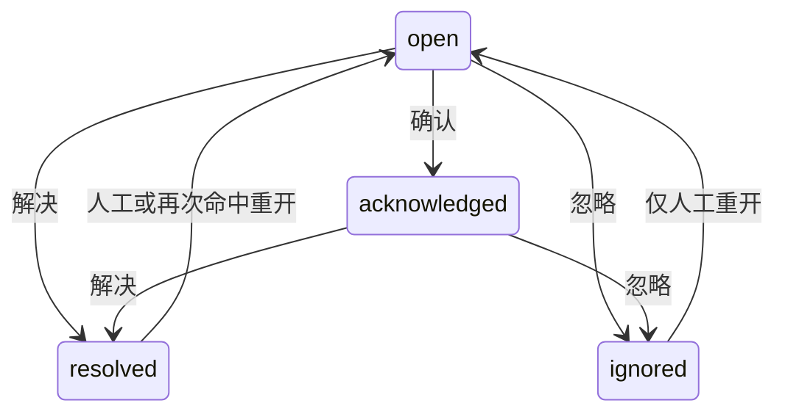
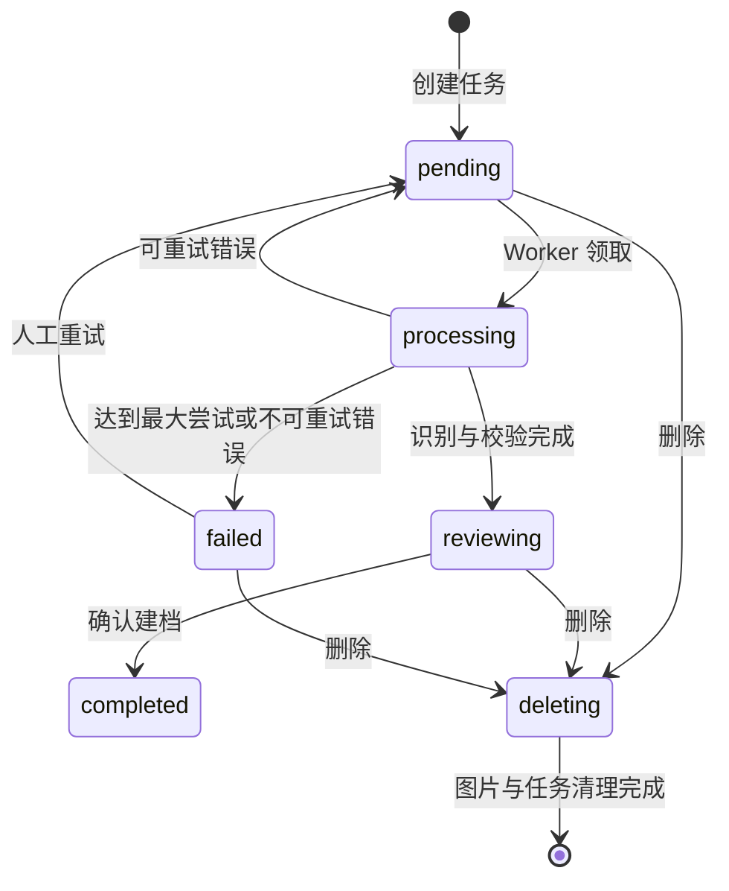

# YuYuan Pass System 功能规格说明

## 1. 文档目的

本文描述当前系统已经实现的功能、关键规则、角色边界和可验收结果。页面文案可能迭代，但业务状态、权限与数据口径应以本文和代码为准。

## 2. 用户与权限

| 角色 | 典型权限 |
| --- | --- |
| 系统管理员 | 用户、角色、菜单、API、字典、系统配置和全部业务模块 |
| 资产管理员 | 资产分类、位置、档案、流转、统计和风险治理 |
| 财务/票据人员 | 发票上传、识别复核、验真、分类、确认和统计 |
| 文档管理员 | 文档上传、编辑、删除和媒体维护 |
| 公告管理员 | 公告草稿、发布、修改和删除 |
| 普通用户 | 查看被授权模块，维护本人日程和通知 |
| 审计人员 | 查看操作历史、登录日志及业务审计记录 |

权限由菜单权限、API 权限和按钮权限共同构成。前端隐藏功能不等于后端授权，所有受保护接口仍须经过 JWT/Casbin 或插件定义的登录校验。

## 3. 首页驾驶舱

### 功能

- 展示资产健康度和核心资产指标。
- 展示最近登记资产。
- 展示资产草稿待办与个人日程摘要。
- 支持亮色/暗色、响应式导航和减少动态效果。

### 验收

- 数据来自后端，不以固定演示数字替代。
- 无数据时显示明确空状态。
- 移动端不产生横向溢出，主要指标仍可读取。

## 4. 资产管理

### 4.1 资产分类

- 字段：名称、编码、颜色、说明、排序、启用状态。
- 分类与资产关联；被使用的分类删除应受业务约束。
- 分类选项只返回可供当前业务使用的记录。

### 4.2 位置字典

支持六类位置：

| 类型 | 用途 |
| --- | --- |
| `inbound` | 入库位置 |
| `usage` | 使用位置 |
| `transfer` | 调入位置 |
| `return` | 归还位置 |
| `maintenance` | 维修位置 |
| `disposal` | 处置位置 |

位置支持名称、编码、说明、排序和启停。停用位置不进入新单据选项，但历史单据保存的是文本快照，不受字典后续变更影响。

### 4.3 资产档案

核心字段：资产编号、名称、分类、品牌、型号、序列号、规格参数、生产日期、数量、单位、采购单价、原值、当前估值、状态、位置、保管人、供应商、购置日期、质保日期、照片和备注。

业务规则：

- 资产原值 = 数量 × 采购单价。
- 新建资产默认 `pending_inbound`。
- 已产生正式流转记录的资产不能直接删除。
- 图片通过上传接口进入对象存储，档案仅保存图片元数据。

### 4.4 资产状态

| 状态 | 含义 |
| --- | --- |
| `pending_inbound` | 已建档、尚未正式入库 |
| `idle` | 已入库、当前闲置 |
| `in_use` | 已领用或调拨至使用状态 |
| `maintenance` | 维修中 |
| `retired` | 已处置 |

### 4.5 资产流转

业务类型：入库、领用、调拨、归还、维修、报废。

共同字段：业务日期、目标位置、目标保管人、原因、备注、资产明细和是否立即提交。

共同规则：

1. 草稿可编辑、可删除，不改变资产主表。
2. 提交时校验资产是否适用于当前业务类型。
3. 提交在事务中更新资产并写入审计快照。
4. 已完成单据不能按草稿方式修改或删除。
5. 当前以整条资产档案为流转单位，不支持部分数量拆分。
6. 报废后状态为 `retired`，当前估值归零。

### 4.6 资产大屏

- 档案数、实物数量、分类数。
- 原值、当前估值、价值减少额。
- 分类价值、状态分布、位置排行和最近登记。
- 所有金额统计使用资产主表当前口径。

### 4.7 资产风险中心

风险中心 V1 使用确定性规则和统计阈值，不调用外部模型。系统预置 17 条规则，覆盖状态、价值、归还与调拨、维修、质保和重复数据六类风险。

总览与查询：

- 展示活动风险、高风险、今日新增和首次命中超过 7 天仍未关闭的风险。
- 展示最近 30 天新增/解决趋势，以及类别、等级、状态和保管人分布。
- 支持按关键词、状态、等级、类别、规则、资产和处理人筛选。
- 详情展示规则证据、建议动作、关联资产和不可覆盖的处理日志。

事件状态机：

- 解决、忽略和人工重开必须填写说明；忽略只能逐条操作。
- 页面批量工具栏提供确认和分配；详情页提供逐条解决、忽略和重开。服务端除忽略外的动作最多接受 100 条 ID。
- 可将风险分配给启用用户，也可取消分配；高风险分配时向处理人发送实时通知。
- 扫描发现活动风险不再命中时自动解决；已解决风险再次命中时自动重开，已忽略风险保持忽略。

规则和扫描：

- 管理员可修改规则等级、阈值和启停；每次更新自动递增版本并保留历史事件证据。
- 支持手动扫描和每天 `02:15` 定时扫描；服务启动后立即执行或恢复失败扫描。
- 每批扫描 200 项资产，使用稳定指纹幂等写入，不开启覆盖全表的长事务。
- 扫描记录保存心跳、游标、计数和失败信息，失败任务最多自动续扫 3 次。
- 高风险/严重风险首次命中和自动重开时广播实时提醒；风险事件本身作为持久处理收件箱。

仓库级验收：17 条规则、幂等、自动解决、版本保留、状态与日志、相似编号算法和参数安全校验已有自动化测试。生产运行验收已于 2026-08-14 通过：`release-acceptance.sh` 8/8 通过，四张风险表已迁移，17 条规则已预置，启动后的定时扫描成功，匿名总览与手动扫描接口均返回 401，容器重启数为 0。管理员页面已在 1440、900、390 三档宽度完成风险总览、列表、规则、扫描记录和详情验收；移动端页头动作栏问题已在提交 `7ddfe9c1e10f78c09ea5680adb31dcfda2a3935c` 修复并发布。生产数据命中质量和默认阈值仍需结合业务数据持续校准。

### 4.8 智能资产建档

智能建档通过持久化任务处理 1-6 张资产照片或铭牌，所有模型请求统一经过 AI Gateway Vision。状态机：

- 模型字段包括名称、品牌、型号、序列号、规格参数、生产日期、推荐分类、单位、质保月数、铭牌原文和字段置信度。
- 模型禁止生成资产编号、采购单价和当前估值，这些字段必须由业务人员或确定性来源填写。
- 多图结果按字段置信度合并；低于 70% 的字段产生人工核对警告。
- 分类只映射到已启用分类；无匹配分类时保留警告并由用户选择。
- 序列号执行完全匹配和去除大小写、空格、分隔符后的标准化匹配，存在候选时禁止确认。
- 用户确认前不创建正式资产；确认在事务内调用共享 Asset Service，同一任务最多创建一次资产。
- 图片清理支持缺失对象幂等；部分失败进入 `deleting`，禁止误进入重新识别。
- 普通用户只访问自己创建的任务，默认管理员可访问全部任务；读写权限分别继承资产列表和资产新增权限。

仓库级验收：识别草稿与单次建档、标准化重复阻断、Schema 失败重试、删除清理重试和权限迁移幂等均有自动化测试。生产 Vision 配置、真实样本和三档页面验收在发布阶段完成。

## 5. 发票与流水管理

### 5.1 上传与识别

- 支持单文件和批量 multipart 上传。
- 原始证据写入 S3 兼容对象存储。
- 系统创建持久化识别任务，记录提供方、尝试次数、状态和错误。
- 根据配置选择百度 OCR、公共 OCR 或多模态提供方；未配置时能力接口应明确返回不可用状态。

### 5.2 发票状态

| 状态 | 含义 |
| --- | --- |
| `uploaded` | 文件已上传 |
| `recognizing` | 正在识别 |
| `pending_review` | 识别完成，等待人工复核 |
| `confirmed` | 已确认，进入正式统计 |
| `recognition_failed` | 识别失败，可重试 |

### 5.3 人工复核与确认

- 可维护发票方向、类型、号码、日期、购销方、金额、税额、价税合计、分类和备注。
- 金额统一使用整数“分”持久化。
- 只有已确认发票进入正式统计。
- 已确认发票不能直接编辑；管理员必须先执行重开。
- 确认时生成防重键，阻止同一关键票据信息重复确认。

### 5.4 验真

验真状态包括未验真、验真中、有效、作废、红冲、不一致、未找到、延期、过期和服务不可用。每次尝试保留结果摘要与差异，敏感原始返回不应直接暴露给前端。

### 5.5 分类规则

- 发票分类支持名称、编码、颜色、说明、排序和启停。
- 分类规则可根据供应商、明细、票种或原始文本评分匹配。
- 系统区分自动分类和人工分类来源，人工决定应具有更高业务优先级。

### 5.6 发票识别质量闭环

- 保存人工复核时比较原识别值与当前人工值，只为实际变化字段保留差异记录。
- 二次保存仍以原识别值为基线；字段改回原值时删除差异，避免把上次人工值误当模型值。
- 税号和校验码只保存 SHA-256 摘要，不在普通日志或质量接口中暴露明文。
- 发票确认将当前修正标记为已进入正式结果；重开、重试和删除同步维护修正状态。
- 质量看板支持 366 天内按时间、Provider、模型和文件类型筛选。
- 指标覆盖识别成功/失败、耗时、尝试、回退、费用、Provider/模型、字段修改率、分类接受率和失败明细。
- 字段准确率采用“已采集复核数据中未被人工修改的比例”；历史无字段级数据单独统计，不参与猜测。
- 数据权限与发票台账一致；质量接口只读取当前用户或其角色可见数据。

仓库级验收：字段差异生命周期、敏感值摘要、正式确认和质量聚合均有自动化测试。生产真实数据口径和三档页面验收在发布阶段完成。

## 6. 文档管理

- 上传原始文档并保存元数据。
- 支持按扩展名分页筛选。
- 支持详情、原文件读取和删除。
- 支持标题、备注与在线编辑内容保存。
- 原文件和在线编辑内容分别保存，在线编辑不覆盖证据文件。
- Word、Excel、PDF、Markdown 和文本采用对应预览/编辑组件；不支持在线编辑的格式仍可下载原文件。

## 7. 媒体库

- 仅接受图片。
- 服务于头像、资产图片、公告/文档插图和登录外观。
- 前后端均应校验格式；服务端负责最终可信校验。
- 生产环境限制文件大小、MIME、扩展名和对象 key。

## 8. 站点收藏

- 新增、编辑、删除、列表和详情。
- 按关键词、分类和启用状态筛选。
- URL 必须是 HTTP/HTTPS。
- 访问动作单独计数并更新最近访问时间。
- 停用站点保留记录，但不应继续作为可用入口。

## 9. 公告中心

- 草稿与发布状态。
- 发布后的公告进入用户通知列表。
- 在线用户通过 SSE 接收提醒，离线用户登录后仍能读取未读状态。
- 支持单条已读和全部已读。
- 已读状态按“用户 + 公告”持久化，可跨设备同步。

## 10. 个人日程

- 每个用户只读写自己的日程，服务端从认证身份确定归属，不接受客户端伪造 `userId`。
- 支持创建、编辑、删除和旧本地数据导入。
- 字段：标题、日期、时间、类型、备注和重复规则。
- 重复规则：每日、每周、每月；可选择星期或月内日期。
- 到期发生项写入持久化通知收件箱。
- 相同用户、日程和发生时间只生成一条通知。
- 支持单条已读和全部已读。

## 11. 系统外观

### 登录图标

- 公开读取当前图标。
- 管理员可保存新图标或恢复默认。
- 推荐 JPG、PNG、WebP，单张不超过 2 MB。

### 登录背景

- 公开读取当前背景。
- 管理员可维护背景图库、激活指定背景和删除非当前背景。
- 上传只加入图库，激活操作才改变登录页。

## 12. 系统管理与审计

- 用户、角色、菜单、按钮和 API 权限。
- 字典、参数、运行配置、API Token、版本和错误日志。
- 登录日志记录认证结果和上下文。
- 关键写操作通过 `OperationRecord()` 记录请求路径、方法、状态和操作人。

## 13. AI Gateway 与运营

- 所有新 AI 业务能力必须通过 `server/ai`，业务 Service 不直接读取 Provider 密钥或调用外部模型。
- 支持 OpenAI Compatible 与 Anthropic；现有自动代码通过兼容 Provider 接入。
- 调用身份以认证 context 为准，并对业务权限路径执行 Casbin 二次校验。
- 配额支持全局、模块、角色和用户的每日请求、Token、月费用和最大并发。
- Prompt 使用不可覆盖的递增版本，激活时退役旧版本，模型输出可绑定 JSON Schema。
- Prompt 和结构化 Payload 在外发前执行大小限制、标准敏感字段和业务敏感词脱敏。
- 图片调用仅允许白名单模块；智能建档要求运行配置包含 `allow-vision-modules: [asset]`。单张最大 10 MB，只支持 JPEG、PNG、WebP 和 GIF。
- 每次成功、失败或阻断都写入不含原文的调用审计；流式调用在 EOF、异常、中断和超限时准确结算状态。
- API Key 为写入即隐藏字段，不进入浏览器响应、调用审计和普通日志。

验收：Provider 可切换；配额并发不可在单实例内突发绕过；Schema、策略、配额、超时和 Provider 错误类型独立；Gateway 关闭不影响非 AI 业务。

## 14. 非功能规格

### 安全

- 生产环境禁用默认 JWT、管理员、数据库、Redis 和对象存储凭据。
- 数据库、Redis、S3 不直接暴露公网。
- 使用 HTTPS 和受信任反向代理。
- 对发票、文档等证据文件执行认证和数据权限校验。

### 性能

- 列表接口分页，避免一次加载大字段。
- 文档列表不返回正文和存储地址。
- 大文件在用户明确进入编辑时才解析。
- 仪表盘使用聚合查询，不在浏览器遍历全量业务数据。
- 风险扫描按固定批次提交并保存游标，不以单个长事务锁定全部资产。

### 可用性

- 移动端支持基础查询和操作。
- 所有异步页面提供加载、空、失败和重试状态。
- 重要状态不能只依赖颜色表达。

### 可维护性

- 新业务优先采用插件目录。
- 业务规则写在 Service，不散落在页面或 Handler。
- 变更接口、数据或部署方式时同步更新对应文档。

## 15. 产品边界

当前未形成完整闭环的能力包括：资产盘点和标签、审批流、折旧会计、采购供应链、团队日历、多人实时文档协作、企业级全文检索和正式财务凭证接口。智能建档已覆盖“识别、草稿、重复检测、人工确认”链路，发票质量已覆盖字段修正与质量指标，但都仍需持续使用真实生产样本校准。预测性维修、报废建议和采购预测仍属于后续决策能力。开发这些能力前应先建立独立领域模型和权限边界，不以空菜单代替实现。
