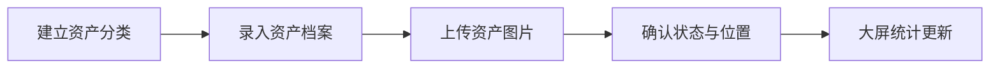
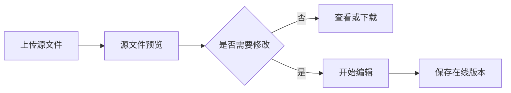
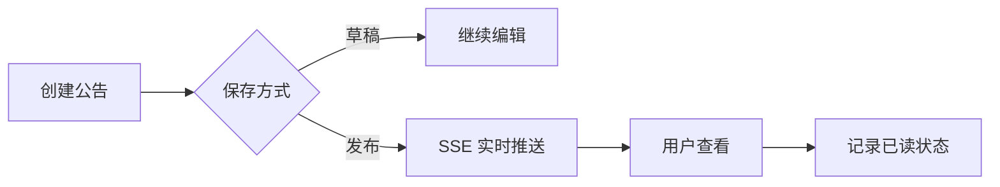
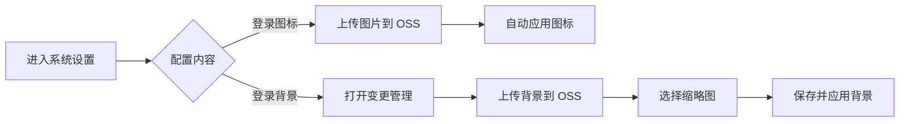

# YuYuan Pass System 产品说明书

## 1. 产品概述

### 1.1 产品名称

YuYuan Pass System（资产管理中心）。

### 1.2 产品定位

面向企业内部行政、IT、运维和综合管理场景，统一管理资产档案、知识文档、常用工作入口和内部公告。系统通过可视化统计、权限控制、对象存储和操作审计，提高资产信息准确性与日常协作效率。

### 1.3 目标用户

| 用户 | 主要职责 |
| --- | --- |
| 系统管理员 | 用户、角色、菜单、API、系统设置和基础设施配置 |
| 资产管理员 | 资产分类、资产建档、状态和位置维护、统计分析 |
| 文档管理员 | 文档上传、预览、在线编辑和版本维护 |
| 普通用户 | 查询授权范围内的资产、文档、站点和公告 |
| 审计人员 | 查看操作记录、登录日志和数据变更情况 |

## 2. 产品目标

1. 建立统一、可查询的资产数据台账。
2. 提供资产数量和价值的实时可视化视图。
3. 集中文档的存储、预览和轻量在线编辑能力。
4. 将常用内部系统入口汇总到统一工作台。
5. 通过实时公告和未读状态提升信息触达率。
6. 通过 RBAC 和操作日志保证系统可管、可查、可审计。

## 3. 功能范围

当前第一阶段采用以下业务信息架构：

```text
首页驾驶舱
资产管理
├─ 资产档案
└─ 分类管理
协同办公
├─ 文档管理
├─ 站点收藏
├─ 公告管理
└─ 媒体库
系统管理
├─ 用户管理
├─ 角色权限
├─ 操作审计
└─ 系统配置
```

尚未完成的入库、领用、调拨、归还、维修、报废、盘点、财务及供应链模块不以空菜单形式展示，待对应业务模型和页面完成后分阶段开放。

### 3.1 资产可视化

资产大屏提供以下指标：

- 资产档案种类与实物总量。
- 资产分类数量。
- 资产原值、当前估值和价值减少额。
- 分类资产价值对比。
- 分类数量与价值滚动明细。
- 资产状态构成。
- 资产位置排行。
- 最近登记资产。

大屏支持亮色、暗色、全屏显示和减少动态效果模式。

### 3.2 资产档案

每条资产档案包含：

- 资产编号与资产名称。
- 分类、品牌、型号和序列号。
- 数量、单位、采购单价、资产原值和当前估值。
- 使用状态、位置和保管人。
- 供应商、采购日期、照片和备注。

系统按“数量 × 采购单价”计算资产原值，支持按分类、状态、位置和关键词检索。

### 3.3 资产分类

支持分类名称、分类编码、展示颜色、说明和排序管理。分类与资产档案关联，并在大屏和列表中形成统一统计口径。

### 3.4 文档中心

文档中心提供：

- 多格式文件上传与 OSS 存储。
- Word、Excel、PDF、Markdown 和文本预览。
- Markdown、文本、富文本和 Excel 在线编辑。
- 源文件与在线版本分离保存。
- 文件列表、详情、下载和删除。

源文件优先展示，用户明确点击“开始编辑”后才进入编辑状态，避免误操作和大文件无效解析。

### 3.5 媒体库

媒体库仅接受图片文件，服务于资产照片、头像、文档插图和登录背景。上传接口在前后端同时校验图片类型，并统一写入 S3 兼容对象存储。

### 3.6 站点收藏

提供 HTTP/HTTPS 站点的新增、编辑、删除、分类、搜索、启停、排序和访问计数。站点以紧凑卡片展示，点击后在新窗口打开。

### 3.7 公告中心

公告支持草稿与发布状态、富文本内容和附件。发布后通过 SSE 推送给在线用户，并为所有用户生成可持久化的未读状态。

公告能力包括：

- 实时提醒与顶部未读徽标。
- 最近公告列表。
- 公告详情和附件。
- 单条已读和全部已读。
- 跨设备同步已读状态。

### 3.8 系统外观设置

管理员可以统一维护登录品牌外观：

- 上传 JPG、PNG 或 WebP 登录图标到对象存储，并立即应用到登录表单和品牌区域。
- 恢复系统内置的默认登录图标。
- 上传登录背景到对象存储，在背景图库中查看缩略图，选择目标背景后保存并应用。
- 桌面端使用左侧背景、右侧登录表单的独立分区，避免表单遮挡背景；移动端自动切换为纵向布局。

背景上传和启用是两个独立步骤，防止误切换。登录图标限制为 2 MB，登录背景限制为 10 MB。

系统主界面的展开侧边栏提供资产管理提示卡，折叠、移动端和低高度窗口下自动隐藏；顶部公告铃铛以紧凑徽标显示未读数量。

### 3.9 权限与审计

系统采用 JWT 进行会话鉴权，使用 Casbin 实现基于角色的访问控制。权限范围包括：

- 菜单权限。
- API 权限。
- 页面按钮权限。
- 多角色切换。

系统记录关键操作和登录信息，便于追踪用户、时间、接口、请求结果和错误信息。

## 4. 核心业务流程

### 4.1 资产建档流程



### 4.2 文档协作流程



### 4.3 公告发布流程



### 4.4 登录外观变更流程



## 5. 数据说明

### 5.1 资产状态

| 状态 | 含义 |
| --- | --- |
| 使用中 | 资产处于正常使用状态 |
| 闲置 | 资产可用但当前未投入使用 |
| 维修中 | 资产正在维修或等待处理 |
| 已处置 | 资产已经报废、出售或移出管理范围 |

### 5.2 价值口径

- 资产原值：数量乘以采购单价。
- 当前估值：由资产管理员维护的当前参考价值。
- 价值减少额：资产原值减去当前估值。
- 价值保有率：当前估值除以资产原值。

这些指标用于内部资产管理和趋势分析，不替代财务系统中的折旧、凭证和法定会计数据。

### 5.3 文件存储

- 结构化业务数据存储在 PostgreSQL。
- 会话与缓存数据使用 Redis。
- 图片和文档源文件存储在 S3 兼容对象存储。
- 在线编辑内容作为业务版本保存，不直接覆盖源文件。

## 6. 非功能要求

### 6.1 兼容性

- 推荐使用最新两个稳定版本的 Chrome 或 Edge。
- 页面支持常见桌面分辨率和移动端基础访问。
- 支持亮色与暗色主题。
- 支持浏览器“减少动态效果”偏好。

### 6.2 性能

- 前端采用路由级动态加载和带哈希的静态资源缓存。
- HTML 入口禁止长期缓存，避免发布后引用旧资源。
- 大屏数据由聚合接口一次返回。
- 公告采用 SSE 实时事件，并使用定时刷新作为降级方案。

### 6.3 安全

- JWT 用户认证。
- Casbin RBAC 授权。
- 上传文件类型双端校验。
- 关键写操作记录操作日志。
- 配置文件和密钥不进入版本库。
- 生产环境建议使用 HTTPS、网络隔离和最小权限账号。

### 6.4 可维护性

- 业务能力按插件拆分。
- 自定义 Dockerfile 和部署脚本保留在仓库中。
- 数据表通过 GORM 自动迁移。
- 管理员菜单和 API 权限在插件注册时初始化。

## 7. 部署拓扑

系统默认由两个容器组成：

| 容器 | 说明 | 默认端口 |
| --- | --- | --- |
| Web | Nginx 托管 Vue 静态文件并代理 API | 8080 |
| Server | Gin API、业务服务、SSE 和 Swagger | 8888 |

PostgreSQL、Redis 和对象存储作为外部服务接入。生产环境建议由统一数据库、缓存和对象存储平台托管。

## 8. 备份与恢复

应至少备份：

1. PostgreSQL 业务数据库。
2. S3 兼容对象存储中的资产图片和文档文件。
3. 生产环境 `.env` 与 `config.yaml`，保存在独立的密钥管理或备份系统中。

恢复时应先恢复数据库与对象存储，再启动应用，并确认对象 URL 和桶策略与恢复环境一致。

## 9. 产品边界

- 系统不是专业财务核算系统，不生成会计凭证。
- 在线文档编辑面向轻量协作，不完全等同于桌面 Office 的排版能力。
- 旧版 Word 二进制文件和复杂 Excel 样式可能无法完整还原。
- 对象存储的可用性、容量和备份由部署环境负责。
- 公告 SSE 依赖代理保持长连接；断开时会降级为定时拉取。

## 10. 验收建议

### 10.1 功能验收

- 完成分类新增、资产建档、查询、编辑和删除。
- 检查大屏数量和金额与资产档案一致。
- 上传 Word、Excel、PDF 和 Markdown 并验证预览。
- 验证在线版本保存不覆盖源文件。
- 发布公告并验证在线推送、未读和已读状态。
- 上传登录图标并验证登录表单和品牌区域生效，再执行恢复默认图标。
- 上传登录背景，选择并保存后验证登录页生效，确认右侧登录表单不覆盖背景图。
- 为非管理员角色分配菜单和 API 权限并验证访问边界。

### 10.2 部署验收

- Web 首页返回 HTTP 200。
- API 健康可访问，Swagger 正常打开。
- PostgreSQL、Redis 和对象存储连接正常。
- 缺失静态资源返回 404，不回退为 HTML。
- HTML 入口使用 no-store，带哈希资源使用长期缓存。
- 容器重启后数据、文件和配置保持不丢失。

## 11. 版本信息

- 产品文档版本：1.1
- 基础应用版本：2.9.2
- 文档更新时间：2026-07-16
