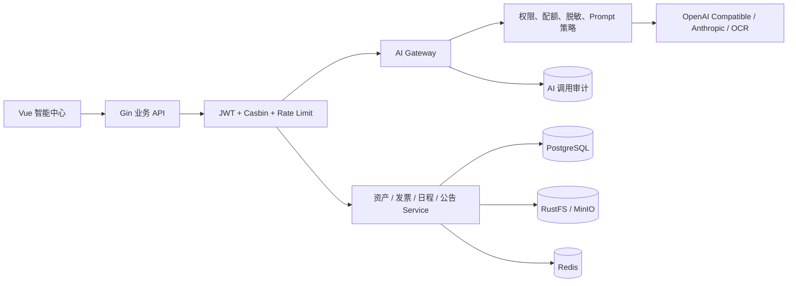

# 智能资产运营中心开发实施文档

> 文档版本：1.0
> 编制日期：2026-08-13
> 适用项目：YuYuan Pass System
> 文档状态：待立项执行
> 建议发布方式：按里程碑独立发布，不等待全部功能完成

## 1. 文档目的

本文是“智能资产运营中心”的开发执行依据，用于产品排期、技术设计、任务拆分、测试验收、发布门禁和进度跟踪。

首期产品包含四个核心能力：

1. 智能建档：通过资产照片、铭牌和标签识别字段，生成待确认资产草稿。
2. 风险中心：检测状态、价值、归还、维修、质保和重复数据异常。
3. 业务助手：使用自然语言查询资产、发票、日程和公告。
4. 智能日报：每日汇总异常、待办、趋势和系统运行情况。

本文同时包含这些能力共同依赖的 AI 安全底座、统一 Gateway、调用审计、配额和发票质量闭环。

## 2. 当前系统基础

### 2.1 可以直接复用的能力

| 现有能力 | 可复用内容 |
| --- | --- |
| JWT + Casbin | AI 接口、Tool 和页面权限 |
| OperationRecord | 高风险操作审计 |
| 发票 OCR/多模态 Provider | 模型协议、图片输入、置信度、Provider 探测 |
| 发票识别任务 | 持久化任务、租约、失败恢复、并发限制 |
| PostgreSQL | 智能任务、风险事件、日报和审计数据 |
| Redis | 限流、配额缓存、短期结果缓存 |
| RustFS/MinIO | 资产照片、铭牌和识别证据 |
| 公告与日程通知 | 风险提醒、日报触达 |
| 动态菜单和 API 权限 | 智能中心页面和接口分配 |
| 首页驾驶舱 | 智能简报和风险摘要入口 |

### 2.2 当前缺口

- AI 相关路由存在公开暴露风险。
- 没有统一 AI Gateway、模型策略和调用审计。
- 没有用户、角色和模块级配额。
- 资产域没有图像识别任务和人工确认闭环。
- 风险规则没有统一实体、生命周期和处理记录。
- 发票没有字段级“模型值到人工值”修正记录。
- 业务助手没有受控 Tool 层、引用和权限透传。
- 日报没有确定性指标快照、订阅和发送记录。
- 没有统一评测集、模型版本和 Prompt 版本管理。

## 3. 项目目标与非目标

### 3.1 首期目标

- 所有 AI 请求经过认证、授权、限流、脱敏和审计。
- 风险中心即使没有外部模型也能独立运行。
- 智能建档只生成草稿，不直接改变正式资产数据。
- 业务助手首版只读，所有回答可追溯到业务数据。
- 智能日报的结构化指标不依赖模型，模型不可用时仍可展示。
- 模型输出必须经过确定性校验和人工确认。

### 3.2 首期非目标

- 不训练私有大模型。
- 不允许模型直接执行任意 SQL。
- 不允许模型自动提交资产流转、自动报废或自动确认发票。
- 不在首期实现预测性维修、采购需求预测和现金流预测。
- 不在首期实现文档 RAG 和图像向量相似检索。
- 不替换现有发票识别链，只逐步接入统一 Gateway。

## 4. 成功指标

### 4.1 安全指标

- 未认证 AI 请求拦截率为 100%。
- 所有模型调用均有用户、模型、耗时、Token、结果状态和业务对象记录。
- 敏感字段进入第三方模型前完成脱敏或得到明确策略许可。
- 高风险业务动作自动执行数量为 0。

### 4.2 业务指标

| 功能 | 首期目标 |
| --- | --- |
| 风险中心 | 覆盖不少于 15 条确定性风险规则 |
| 智能建档 | 支持照片和铭牌，核心字段均返回置信度 |
| 建档效率 | 相比纯手工填写减少 40% 以上操作时间 |
| 发票质量 | 可统计字段级人工修改率和 Provider 质量 |
| 业务助手 | 首批不少于 12 个只读 Tool |
| 回答追溯 | 100% 数据型回答包含查询范围和来源 |
| 智能日报 | 模型不可用时仍生成完整结构化日报 |

## 5. 目标产品结构

```text
智能中心
├─ 智能建档
│  ├─ 新建识别
│  ├─ 待确认草稿
│  ├─ 识别历史
│  └─ 失败任务
├─ 风险中心
│  ├─ 风险总览
│  ├─ 高风险
│  ├─ 待处理
│  ├─ 已解决
│  └─ 已忽略
├─ 业务助手
│  ├─ 智能问答
│  ├─ 历史会话
│  ├─ 数据引用
│  └─ 业务草稿（后续）
├─ 智能日报
│  ├─ 今日简报
│  ├─ 历史日报
│  ├─ 订阅设置
│  └─ 发送记录
└─ AI 管理
   ├─ 模型配置
   ├─ 调用审计
   ├─ 配额管理
   ├─ Prompt 版本
   └─ 质量看板
```

## 6. 总体技术架构



### 6.1 核心原则

1. 业务 Service 是业务规则唯一入口，AI 不能绕过。
2. AI 只处理不确定性，确定性状态和金额校验由代码完成。
3. 查询通过业务 Tool，不开放任意 SQL。
4. 模型输出采用严格 JSON Schema 并执行二次校验。
5. 所有写操作先生成草稿，再由用户确认。
6. 模型失败不影响核心资产、发票和日程功能。
7. 每次回答和建议必须可解释、可追溯、可撤销。

## 7. 里程碑总览

| 里程碑 | 交付内容 | 预计人日 | 依赖 |
| --- | --- | ---: | --- |
| M0 | AI 路由安全与权限门禁 | 1-2 | 无 |
| M1 | 最小 AI Gateway、审计、配额、脱敏 | 4-7 | M0 |
| M2 | 资产风险中心 V1 | 5-8 | M0 |
| M3 | 发票修正差异与质量看板 | 5-8 | M1 |
| M4 | 智能资产建档 MVP | 7-12 | M1 |
| M5 | 只读业务助手 | 8-15 | M1、M2 |
| M6 | 智能日报与订阅 | 4-7 | M2、M5 可选 |
| M7 | 公告提取日程、业务草稿 | 5-8 | M5 |

单人全职完成 M0-M6 的保守估算为 34-59 人日。首个可演示版本建议交付 M0、M1、M2 和 M4，预计 17-29 人日。

## 8. M0：AI 路由安全

### 8.1 目标

封闭匿名 AI 调用和高风险初始化入口，建立最小权限边界。

### 8.2 任务清单

- [ ] AI-SEC-001 将 `llmAuto` 移入 JWT + Casbin 私有路由。
- [ ] AI-SEC-002 将 `llmAutoSSE` 移入 JWT + Casbin 私有路由。
- [ ] AI-SEC-003 将 `initMenu`、`initAPI`、`initDictionary` 移入私有写路由。
- [ ] AI-SEC-004 为 AI 调用和三个初始化动作建立独立 API 权限。
- [ ] AI-SEC-005 为初始化动作挂载 `OperationRecord`。
- [ ] AI-SEC-006 增加用户级请求频率限制。
- [ ] AI-SEC-007 限制单用户 SSE 并发连接。
- [ ] AI-SEC-008 限制请求体大小和最大响应时间。
- [ ] AI-SEC-009 对上游 Endpoint 建立协议及主机白名单策略。
- [ ] AI-SEC-010 增加未认证、未授权和限流测试。

### 8.3 权限建议

| 权限 | 角色建议 |
| --- | --- |
| AI 普通调用 | 授权业务用户 |
| AI 工作流 | 开发人员、管理员 |
| 初始化菜单/API/字典 | 超级管理员 |
| MCP 服务管理 | 超级管理员 |
| AI 调用审计 | 管理员、审计员 |
| AI 配额管理 | 超级管理员 |

### 8.4 验收标准

- 未登录请求返回 HTTP 401。
- 登录但无权限请求返回权限拒绝。
- 普通 AI 用户不能调用初始化和 MCP 管理接口。
- 限流生效且不会影响普通业务 API。
- SSE 断开后资源和并发计数正确释放。
- 安全测试和现有自动代码测试全部通过。

## 9. M1：统一 AI Gateway

### 9.1 推荐目录

```text
server/ai/
├─ gateway.go
├─ request.go
├─ response.go
├─ provider.go
├─ policy.go
├─ quota.go
├─ redaction.go
├─ audit.go
├─ prompt.go
└─ providers/
   ├─ openai_compatible.go
   └─ anthropic.go
```

### 9.2 Gateway 接口

```go
type Gateway interface {
    Complete(ctx context.Context, request CompletionRequest) (CompletionResult, error)
    Vision(ctx context.Context, request VisionRequest) (VisionResult, error)
    Embed(ctx context.Context, request EmbeddingRequest) (EmbeddingResult, error)
}
```

首期实现 `Complete` 和 `Vision`。`Embed` 接口预留，文档 RAG 阶段再实现。

### 9.3 调用流程

```text
接收业务请求
→ 校验当前用户和模块权限
→ 校验日配额、月预算和并发数
→ 执行字段脱敏和输入大小检查
→ 解析 Prompt 模板与版本
→ 调用 Provider
→ 校验 JSON Schema 和输出大小
→ 记录 Token、费用、耗时和结果
→ 返回业务 Service
```

### 9.4 数据表

#### `ai_model_invocations`

| 字段 | 说明 |
| --- | --- |
| `request_id` | 全链路追踪 ID |
| `user_id` / `authority_id` | 调用人和角色 |
| `module` | asset、invoice、copilot、report 等 |
| `operation` | recognize、summarize、intent 等 |
| `provider` / `model` | 提供方和模型 |
| `prompt_key` / `prompt_version` | Prompt 标识和版本 |
| `input_tokens` / `output_tokens` | Token 用量 |
| `estimated_cost_micros` | 估算费用，最小货币单位 |
| `duration_ms` | 调用耗时 |
| `status` | success、failed、blocked |
| `error_type` | 超时、限流、Provider、Schema 等 |
| `object_type` / `object_id` | 关联业务对象 |
| `redaction_count` | 脱敏字段数量 |
| `input_hash` / `output_hash` | 内容哈希 |

默认不保存完整 Prompt、图片和模型响应。调试采样必须可配置、加密、限时保留并受审计权限控制。

#### `ai_usage_quotas`

| 字段 | 说明 |
| --- | --- |
| `scope_type` | user、authority、module、global |
| `scope_id` | 对应主体 |
| `daily_requests` | 每日请求数 |
| `daily_tokens` | 每日 Token |
| `monthly_cost_micros` | 月预算 |
| `max_concurrency` | 最大并发 |
| `enabled` | 是否启用 |

#### `ai_prompt_templates`

| 字段 | 说明 |
| --- | --- |
| `prompt_key` | 稳定业务标识 |
| `version` | 版本 |
| `content` | Prompt 模板 |
| `output_schema` | JSON Schema |
| `status` | draft、active、retired |
| `created_by` | 创建人 |
| `activated_at` | 启用时间 |

### 9.5 脱敏规则

至少支持：

- 税号中间位脱敏。
- 手机号和邮箱脱敏。
- 身份证和银行卡脱敏。
- 内网 IP、Token、Secret、Password 脱敏。
- 用户可配置业务敏感词。
- 图片是否允许发送第三方由模块策略决定。

### 9.6 API

| 方法 | 路径 | 说明 |
| --- | --- | --- |
| GET | `/ai/providers` | 可用 Provider 和模型 |
| GET | `/ai/usage/summary` | 当前用户用量 |
| GET | `/ai/invocations` | 管理员调用审计 |
| GET | `/ai/quotas` | 配额列表 |
| PUT | `/ai/quotas` | 更新配额 |
| GET | `/ai/prompts` | Prompt 列表 |
| POST | `/ai/prompts` | 新建 Prompt 版本 |
| PUT | `/ai/prompts/activate` | 激活版本 |

### 9.7 验收标准

- Provider 切换不影响业务 Service 接口。
- 超时、限流、配额耗尽和 Schema 错误具有独立错误类型。
- 每次调用都有审计记录。
- API Key 不进入 JSON 响应、日志和审计表。
- 模型不可用时返回可恢复错误，不阻断非 AI 业务。

## 10. M2：资产风险中心 V1

### 10.1 架构

风险中心第一版采用确定性规则和统计阈值，不依赖大模型。

```text
定时扫描 / 手动扫描
→ 加载启用规则
→ 按批次查询资产与流转记录
→ 生成风险证据和指纹
→ 新建或更新风险事件
→ 自动关闭已不再命中的风险
→ 发送高风险通知
```

### 10.2 数据表

#### `asset_risk_rules`

| 字段 | 说明 |
| --- | --- |
| `code` | 规则编码 |
| `name` | 规则名称 |
| `category` | status、value、return、maintenance、warranty、duplicate |
| `severity` | low、medium、high、critical |
| `parameters` | JSON 阈值 |
| `enabled` | 是否启用 |
| `version` | 规则版本 |

#### `asset_risk_events`

| 字段 | 说明 |
| --- | --- |
| `fingerprint` | 资产 + 规则 + 关键证据的唯一指纹 |
| `asset_id` | 资产 ID |
| `rule_code` / `rule_version` | 命中规则 |
| `severity` | 风险等级 |
| `status` | open、acknowledged、resolved、ignored |
| `title` / `description` | 风险说明 |
| `evidence` | JSON 证据快照 |
| `recommendation` | 推荐动作 |
| `first_detected_at` / `last_detected_at` | 首次和最近命中 |
| `assigned_to` | 处理人 |
| `handled_by` / `handled_at` | 处理记录 |
| `resolution_note` | 处理说明 |

#### `asset_risk_scan_runs`

记录开始时间、结束时间、扫描资产数、新增/更新/关闭风险数、错误和触发方式。

### 10.3 首批规则

| 编码 | 风险 |
| --- | --- |
| `ASSET_PENDING_TOO_LONG` | 待入库超过阈值 |
| `ASSET_IN_USE_WITHOUT_CUSTODIAN` | 使用中无保管人 |
| `ASSET_IDLE_WITH_CUSTODIAN` | 闲置但仍有保管人 |
| `ASSET_RETIRED_WITH_CUSTODIAN` | 已处置但仍有保管人 |
| `ASSET_RETIRED_VALUE_NONZERO` | 已处置但估值不为零 |
| `ASSET_VALUE_OVER_ORIGINAL` | 当前估值高于原值 |
| `ASSET_HIGH_VALUE_IDLE` | 高价值资产长期闲置 |
| `ASSET_WARRANTY_MISSING` | 重要资产无质保信息 |
| `ASSET_WARRANTY_EXPIRING` | 质保即将到期 |
| `ASSET_WARRANTY_EXPIRED` | 质保已过期 |
| `ASSET_MAINTENANCE_OVERDUE` | 维修时间过长 |
| `ASSET_FREQUENT_MAINTENANCE` | 短期频繁维修 |
| `ASSET_FREQUENT_TRANSFER` | 短期频繁调拨 |
| `ASSET_LONG_TERM_IN_USE` | 长期未归还 |
| `ASSET_DUPLICATE_SERIAL` | 重复序列号 |
| `ASSET_SIMILAR_CODE` | 疑似重复资产编号 |
| `ASSET_STATE_RECORD_MISMATCH` | 当前状态与最近流转不一致 |

### 10.4 API

| 方法 | 路径 | 说明 |
| --- | --- | --- |
| GET | `/assetRisk/dashboard` | 风险总览 |
| GET | `/assetRisk/list` | 分页、等级、类型、状态筛选 |
| GET | `/assetRisk/detail` | 风险详情 |
| POST | `/assetRisk/scan` | 手动扫描 |
| PUT | `/assetRisk/acknowledge` | 确认风险 |
| PUT | `/assetRisk/resolve` | 标记解决 |
| PUT | `/assetRisk/ignore` | 忽略并填写原因 |
| PUT | `/assetRisk/reopen` | 重新打开 |
| GET | `/assetRisk/rules` | 规则列表 |
| PUT | `/assetRisk/rules` | 修改阈值和启停 |

### 10.5 页面

- 风险指标：总数、高风险、今日新增、已逾期。
- 趋势：最近 30 天新增与解决数量。
- 分布：按风险类别、等级、部门或保管人。
- 列表：证据、推荐动作、相关资产和处理状态。
- 详情：规则说明、证据快照、资产时间线、处理日志。
- 批量操作仅允许“确认”和“分配”，不允许批量忽略高风险。

### 10.6 验收标准

- 同一风险重复扫描不会生成重复事件。
- 风险不再命中后能自动解决或标记待复核。
- 修改规则版本不会破坏历史证据。
- 扫描任务可恢复、可观测，不使用长事务锁表。
- 每条风险都能跳转到资产或流转详情。

## 11. M3：发票识别质量闭环

### 11.1 数据表

#### `invoice_review_corrections`

| 字段 | 说明 |
| --- | --- |
| `invoice_id` / `recognition_job_id` | 发票和识别任务 |
| `invocation_id` | AI 调用审计关联 |
| `field_name` | 字段名 |
| `recognized_value` | 模型原值 |
| `corrected_value` | 人工最终值 |
| `confidence` | 字段置信度 |
| `provider` / `model` | 模型信息 |
| `corrected_by` / `corrected_at` | 修正人和时间 |
| `confirmed` | 是否进入最终确认 |

对于税号、校验码等敏感字段，应保存加密值或脱敏快照。

### 11.2 质量指标

- 总识别量、成功率、失败率。
- 平均耗时和平均尝试次数。
- OCR 回退多模态比例。
- 按 Provider、模型和文件类型统计质量。
- 字段级人工修改率。
- 发票号码、金额、税额、税号等关键字段准确率。
- 分类推荐接受率和推翻率。
- 失败原因和费用分布。

### 11.3 API

| 方法 | 路径 | 说明 |
| --- | --- | --- |
| GET | `/invoiceQuality/dashboard` | 质量总览 |
| GET | `/invoiceQuality/providerMetrics` | Provider 指标 |
| GET | `/invoiceQuality/fieldMetrics` | 字段准确率和修改率 |
| GET | `/invoiceQuality/failures` | 失败原因明细 |
| GET | `/invoiceQuality/classificationMetrics` | 分类规则效果 |

### 11.4 验收标准

- 保存复核时自动计算字段差异。
- 不记录未改变字段。
- 历史数据明确标记为“无字段级修正数据”。
- 看板支持按时间、Provider 和模型版本筛选。
- 原始敏感值不出现在普通日志。

## 12. M4：智能资产建档 MVP

### 12.1 用户流程


### 12.2 数据表

#### `asset_recognition_jobs`

| 字段 | 说明 |
| --- | --- |
| `status` | pending、processing、reviewing、completed、failed |
| `attempts` / `max_attempts` | 尝试次数 |
| `provider` / `model` | 使用模型 |
| `prompt_version` | Prompt 版本 |
| `file_keys` | 输入图片对象 key |
| `result` | 结构化识别结果 |
| `field_confidences` | 字段置信度 |
| `warnings` | 校验警告 |
| `duplicate_candidates` | 重复候选 |
| `lock_token` / `locked_at` | 任务租约 |
| `created_by` | 创建用户 |
| `confirmed_asset_id` | 最终资产 ID |

### 12.3 识别字段

- 资产名称。
- 品牌。
- 型号。
- 序列号。
- 规格参数。
- 生产日期。
- 推荐分类。
- 推荐计量单位。
- 推荐质保月数。
- 铭牌原始文本。
- 每个字段置信度。

模型不负责生成资产编号和价格。资产编号由现有业务规则或用户填写；价格来自采购证据或人工录入。

### 12.4 确定性校验

- 分类必须存在且启用。
- 序列号执行完全匹配和标准化匹配。
- 日期不能明显晚于当前日期。
- 型号、品牌、分类冲突时只警告，不擅自修改。
- 低于字段阈值的内容标记“需要确认”。
- 同一识别任务不能重复创建正式资产。
- 正式创建仍调用现有资产 Service。

### 12.5 API

| 方法 | 路径 | 说明 |
| --- | --- | --- |
| POST | `/assetRecognition/create` | 上传图片并创建任务 |
| GET | `/assetRecognition/list` | 识别任务列表 |
| GET | `/assetRecognition/detail` | 任务、结果和候选重复资产 |
| POST | `/assetRecognition/retry` | 重试失败任务 |
| PUT | `/assetRecognition/draft` | 保存人工修正草稿 |
| POST | `/assetRecognition/confirm` | 确认并创建资产 |
| DELETE | `/assetRecognition/delete` | 删除未完成任务和临时文件 |

### 12.6 页面

- 多图片上传和拍照入口。
- 识别进度和失败原因。
- 左侧图片或铭牌，右侧字段表单。
- 字段置信度、来源区域和警告。
- 重复候选资产对比。
- “保存草稿”“确认建档”“放弃任务”。

### 12.7 验收标准

- 没有模型配置时页面明确提示，不影响普通资产新增。
- 模型返回非法 JSON 时任务进入可重试失败。
- 低置信度字段不会被静默接受。
- 重复序列号禁止直接确认。
- 用户确认前不创建正式资产。
- 成功确认后任务与资产建立不可变关联。

## 13. M5：只读业务助手

### 13.1 首期边界

- 只读查询。
- 不开放任意 SQL。
- 不调用写接口。
- 不访问当前用户无权访问的数据。
- 不根据模型文本自行决定数据范围。

### 13.2 Tool 列表

| Tool | 功能 |
| --- | --- |
| `asset.search` | 查询资产 |
| `asset.detail` | 资产详情 |
| `asset.risk.list` | 查询风险 |
| `asset.warranty.expiring` | 查询即将过保资产 |
| `asset.custodian.summary` | 保管人持有资产摘要 |
| `asset.operation.summary` | 流转统计 |
| `invoice.summary` | 发票统计 |
| `invoice.pending_reviews` | 待复核发票 |
| `invoice.failed_recognitions` | 识别失败任务 |
| `invoice.provider_quality` | 识别质量摘要 |
| `schedule.today` | 今日和近期日程 |
| `announcement.unread` | 未读公告 |

### 13.3 调用链

```text
用户问题
→ Gateway 解析意图和 Tool 参数
→ Tool Registry 校验允许列表
→ JWT/Casbin 和数据范围检查
→ 调用现有 Service 或只读查询服务
→ 返回结构化结果和引用
→ Gateway 生成自然语言解释
```

### 13.4 数据表

#### `ai_copilot_sessions`

保存用户会话、标题、状态和最后活动时间。

#### `ai_copilot_messages`

保存角色、文本摘要、Tool 调用、引用、模型、Token 和错误。敏感原始结果按保留策略处理。

### 13.5 引用格式

每个数据回答必须包含：

- 查询时间。
- 查询范围和筛选条件。
- Tool 名称。
- 命中记录数量。
- 业务对象 ID。
- 可跳转页面和筛选参数。

### 13.6 API

| 方法 | 路径 | 说明 |
| --- | --- | --- |
| POST | `/copilot/query` | 普通问答 |
| POST | `/copilot/queryStream` | SSE 流式问答 |
| GET | `/copilot/sessions` | 当前用户会话列表 |
| GET | `/copilot/session` | 会话详情 |
| DELETE | `/copilot/session` | 删除本人会话 |
| GET | `/copilot/tools` | 当前用户可用 Tool |

### 13.7 验收标准

- 无权限用户无法通过问法绕过权限。
- 模型生成未注册 Tool 时拒绝执行。
- Tool 参数进行类型和范围校验。
- 所有数字型结论均有结构化引用。
- 模型不可用时原业务查询页面正常。
- 第一版没有任何写操作 Tool。

## 14. M6：智能日报

### 14.1 两层生成

第一层由确定性查询生成指标快照；第二层由模型负责摘要、排序和解释。

模型失败时仍展示指标、列表和跳转入口，只隐藏自然语言摘要。

### 14.2 日报内容

#### 资产

- 今日新增、入库、领用、归还、维修和报废。
- 待入库和长期未归还。
- 新增高风险和已解决风险。
- 30/60/90 天内质保到期。
- 高价值闲置和维修超期。

#### 发票

- 今日上传、识别、复核和确认数量。
- 待复核、低置信度和失败任务。
- 今日、本周、本月已确认金额。
- Provider 失败率和识别积压。

#### 协同

- 今日个人日程。
- 即将到期的重复日程。
- 未读重要公告。

#### 系统

- API 和容器健康摘要。
- 对象存储失败。
- AI 调用失败率、耗时和费用。

### 14.3 数据表

#### `smart_daily_reports`

保存日期、受众类型、受众 ID、指标快照、摘要、模型版本、状态和生成时间。

#### `smart_report_subscriptions`

保存用户订阅范围、发送时间、通知渠道和启用状态。

#### `smart_report_deliveries`

保存每次站内通知或邮件发送结果、失败原因和重试次数。

### 14.4 API

| 方法 | 路径 | 说明 |
| --- | --- | --- |
| GET | `/smartReport/today` | 当前用户今日简报 |
| GET | `/smartReport/list` | 历史日报 |
| GET | `/smartReport/detail` | 日报详情 |
| POST | `/smartReport/generate` | 管理员手动生成 |
| GET | `/smartReport/subscription` | 当前订阅 |
| PUT | `/smartReport/subscription` | 更新订阅 |
| GET | `/smartReport/deliveries` | 发送记录 |

### 14.5 验收标准

- 相同日期和受众幂等生成。
- 日报数字与原业务列表统计一致。
- 每个指标可以跳转到对应筛选列表。
- 模型不可用时结构化日报仍成功。
- 用户只能查看自己的日报；管理日报遵循角色权限。

## 15. M7：智能草稿与公告转日程

### 15.1 公告提取日程

- 公告编辑时提取日期、时间、地点和待办。
- 发布前由公告管理员确认提取结果。
- 接收用户点击“添加到日程”，不得自动创建全部用户日程。
- 保存公告 ID 和日程 ID 关联，避免重复添加。

### 15.2 AI 业务单草稿

业务助手可以解析：

> 给张三领用研发仓库的两台 ThinkPad。

生成草稿时必须展示并确认：

- 业务类型。
- 资产候选。
- 目标位置。
- 保管人。
- 业务日期。
- 原因和备注。

AI 只创建草稿。提交必须继续调用现有资产流转 Service 并由用户主动确认。

## 16. 安全与隐私要求

### 16.1 数据分级

| 级别 | 示例 | 外发策略 |
| --- | --- | --- |
| 公开 | 产品帮助、公开公告 | 可按配置发送 |
| 内部 | 普通资产名称、分类 | 经权限和审计后发送 |
| 敏感 | 保管人、供应商、价格、发票金额 | 脱敏或使用受控私有模型 |
| 高敏 | 税号、身份证、Token、Secret、原始财务证据 | 默认禁止外发 |

### 16.2 Prompt Injection

- 图片和文档中的文字全部视为不可信输入。
- 模型输出不能改变系统 Prompt、Tool 权限和数据范围。
- Tool 参数只能来自受校验的结构化输出。
- 不把数据库错误、密钥、内网地址返回模型。
- 高风险响应保存前执行内容过滤。

### 16.3 数据保留

- 调用审计长期保留元数据和哈希。
- 完整 Prompt 和响应默认不保存。
- 调试采样设置最短保留周期并自动删除。
- 识别原图遵循资产证据保留规则。
- 用户删除会话时同步处理受政策允许删除的内容。

## 17. 可观测性

### 17.1 指标

- AI 请求量、成功率、失败率。
- Token、费用、P50/P95 延迟。
- Provider 限流和超时。
- 配额拦截次数。
- 识别任务积压、重试和陈旧任务。
- 风险扫描耗时、命中和自动关闭数量。
- Copilot Tool 调用量和失败率。
- 日报生成和发送成功率。

### 17.2 告警

- AI Provider 连续失败。
- 单用户或单模块费用异常。
- 识别任务积压超过阈值。
- 风险扫描连续失败。
- 日报未按时生成。
- 脱敏器或审计写入失败。

## 18. 测试策略

### 18.1 单元测试

- Gateway Provider、错误映射和 Schema 校验。
- 配额、并发和费用计算。
- 脱敏规则。
- 每条风险规则的正例、反例和边界值。
- 风险指纹和幂等。
- 资产识别结果标准化与校验。
- 发票字段差异。
- Copilot Tool 参数校验。
- 日报指标计算。

### 18.2 集成测试

- JWT、Casbin、限流和 SSE。
- AI 调用审计事务。
- 识别任务领取、租约恢复和重试。
- 风险扫描与事件状态变化。
- 智能建档确认调用正式资产 Service。
- Copilot 数据权限。
- 日报生成和通知发送。

### 18.3 安全测试

- 未认证和越权调用。
- Prompt Injection。
- SSRF 和私有 Endpoint。
- 超大图片、超长文本和压缩炸弹。
- 模型返回恶意 HTML、Markdown 或非法 JSON。
- 日配额绕过和并发竞争。
- 敏感信息日志扫描。

### 18.4 UI 验收

- 桌面、移动、亮色和暗色。
- 加载、空、失败、重试和无权限状态。
- 低置信度和高风险不能只靠颜色表达。
- 所有 AI 结果明确标注“建议”“草稿”或“待确认”。

## 19. 数据迁移与回滚

### 19.1 迁移原则

- 新功能优先新增表，不直接改变核心资产状态字段。
- 所有新表纳入 GORM 自动迁移和迁移测试。
- 风险规则种子数据必须幂等。
- Prompt 激活采用版本切换，不覆盖历史版本。
- 发票修正数据只从功能上线后准确统计。

### 19.2 回滚

- Gateway 可通过功能开关禁用。
- 智能建档禁用后保留未完成任务，不影响普通建档。
- 风险扫描可停用，历史风险事件只读保留。
- Copilot 和日报可分别关闭。
- 数据表不在普通回滚中删除。
- Provider 配置回滚不删除历史审计记录。

## 20. 发布策略

每个里程碑单独发布：

1. 数据库迁移。
2. Server 测试。
3. Web 测试、Lint 和 Build。
4. Swagger 和开发文档更新。
5. 镜像构建。
6. 测试环境验收。
7. 灰度开放菜单和权限。
8. 生产发布。
9. 执行 `release-acceptance.sh`。
10. 观察指标和错误日志。

AI 功能默认使用功能开关关闭，由管理员按角色逐步开放。

## 21. 开发看板建议

### 21.1 状态

- Backlog：未进入迭代。
- Ready：需求、接口和验收清晰。
- In Progress：正在开发。
- Review：代码和安全审查。
- QA：测试环境验收。
- Ready to Release：满足发布门禁。
- Done：生产验证通过。
- Blocked：存在明确外部阻塞。

### 21.2 任务字段

每个任务必须包含：

- 任务编号。
- 所属里程碑。
- 业务目标。
- 代码范围。
- 数据迁移。
- API 与权限。
- 测试用例。
- 文档更新。
- 风险和回滚。
- 负责人。
- 预计和实际人日。

## 22. 进度跟踪模板

| 里程碑 | 状态 | 负责人 | 计划开始 | 计划完成 | 已完成/总任务 | 风险 |
| --- | --- | --- | --- | --- | --- | --- |
| M0 AI 安全 | Backlog | 待定 | 待定 | 待定 | 0/10 | 无 |
| M1 AI Gateway | Backlog | 待定 | 待定 | 待定 | 0/待拆分 | 需模型配置 |
| M2 风险中心 | Backlog | 待定 | 待定 | 待定 | 0/待拆分 | 阈值需业务确认 |
| M3 发票质量 | Backlog | 待定 | 待定 | 待定 | 0/待拆分 | 历史数据不完整 |
| M4 智能建档 | Backlog | 待定 | 待定 | 待定 | 0/待拆分 | 需多模态模型 |
| M5 业务助手 | Backlog | 待定 | 待定 | 待定 | 0/待拆分 | 依赖 Tool 层 |
| M6 智能日报 | Backlog | 待定 | 待定 | 待定 | 0/待拆分 | 指标口径确认 |

每周至少更新一次状态、风险和实际人日。出现跨里程碑依赖变化时先更新本文，再调整开发看板。

## 23. Definition of Ready

任务进入开发前必须满足：

- 业务场景和用户角色明确。
- 输入、输出、错误和权限明确。
- 数据表与迁移方案明确。
- API 契约明确。
- AI 与确定性代码边界明确。
- 是否允许第三方模型处理数据已经确认。
- 验收用例和回滚方式明确。

## 24. Definition of Done

任务完成必须满足：

- 代码遵循现有插件和 Service 分层。
- 单元、集成和安全测试通过。
- 未引入匿名 AI 接口。
- 所有模型调用可审计。
- 数据权限和 Casbin 权限验证通过。
- UI 具有加载、失败、重试和无权限状态。
- Swagger、API、数据字典、功能规格和用户手册同步更新。
- `git diff --check` 通过。
- 生产构建和发布验收通过。
- 生产指标无异常，回滚方案可执行。

## 25. 建议首个迭代

首个迭代只做 M0 和 M1：

1. 收紧公开 AI 和初始化接口。
2. 建立 AI 权限、限流和审计。
3. 实现 OpenAI Compatible 与 Anthropic Gateway 适配。
4. 增加 Prompt 版本、配额和用量页面。
5. 将现有 AI 工作流代理接入 Gateway。
6. 保持发票识别功能行为不变。

首个迭代验收后再并行启动 M2 风险中心与 M4 智能建档。这样可以先消除风险，再用同一套 AI 基础设施支撑后续功能。

## 26. 立项决策清单

正式排期前需要确认：

- [ ] 首批使用的模型提供方和模型名称。
- [ ] 是否允许资产照片发送第三方模型。
- [ ] 是否存在可用的企业私有模型 Endpoint。
- [ ] 月度 AI 预算和用户配额。
- [ ] 风险规则的默认阈值和责任人。
- [ ] 智能建档首批支持的资产分类。
- [ ] 日报受众、生成时间和通知渠道。
- [ ] AI 调用审计和调试数据保留周期。
- [ ] 测试环境对象存储和模型凭据。
- [ ] 灰度角色和试用人员。

## 27. 关联文档

- [项目审计报告](PROJECT-AUDIT.md)
- [产品说明书](PRODUCT-MANUAL.md)
- [功能规格说明](FUNCTIONAL-SPECIFICATION.md)
- [系统架构说明](ARCHITECTURE.md)
- [API 接口文档](API.md)
- [数据字典](DATA-DICTIONARY.md)
- [开发维护指南](DEVELOPMENT.md)
- [部署运维手册](DEPLOYMENT.md)
